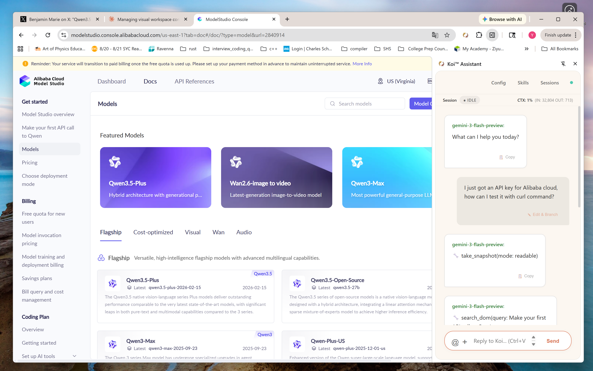
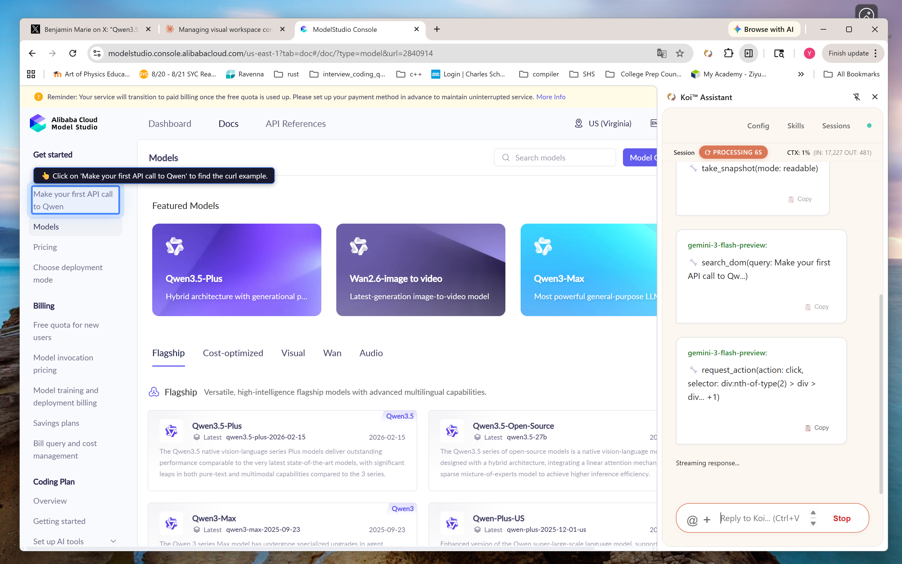

# Koi™ Assistant - The Browser AI Agent

_Koi™ brings peace to your mind_

---

## What is Koi™?

**Koi™** is a privacy-first, provider-agnostic, [enterprise-grade](./docs/enterprise-data-security.md) browser AI agent designed to bridge the gap between static LLM chat and real-world browser automation. Unlike autonomous bots that operate unsupervised, Koi™ acts as a sophisticated **Co-Pilot**, treating the web page as a collaborative workspace where the AI observes, suggests, and executes through a secure, sandboxed skill system.

### 'Out of Box' Use Cases

- **Google Workspace & Microsoft 365 Orchestration:** Use the agent to read Gmail or Outlook threads, Calendar, query Google Sheets or Excel, and generate formatted Docs or Word files via OAuth-secured local MCP servers.
- **Intelligent PDF & Document Analysis:** Spawn independent sub-agents to digest high-volume PDF attachments or long-form documents locally, returning consolidated summaries without overflowing your main conversation's context window.
- **Visual Discussion & Annotation:** Capture any on-screen region using `CTRL + Mouse Select` to start a grounded bi-directional conversation where both you and the AI can draw rectangles, arrows, and text directly over the UI to debug or explain complex layouts.

### Extensibility with 'Skills and MCPs in a Sandbox'

- **Cross-Source Data Reporting:** Chain multiple data sources together, such as querying a PostgreSQL database via a remote gateway and automatically exporting the results into a formatted Google Sheet.
- **Per-page Browser Automation with JS Code:** Write your own Skill's JavaScript code to control your web pages, automate your workflows with **deterministic** precision, low-cost, yet maximum security.
- **Event Triggered Automation:** Program your skill to [watch for](./skills/wait-for-demo/) asynchronous events, then launch sub-agents in a [for loop](./skills/gmail-summarizer/scripts/analyze.js) to handle workflows automatically.

[](https://youtu.be/WOCZ1AfRJ5E)

---

## The Philosophy: The Browser as the Enterprise OS

To realize the true ROI of AI in the enterprise, we must shift our perspective on where automation lives. Most organizations attempt to bolt AI onto their operations using detached cloud bots or developer-centric command-line tools. These approaches consistently fail to scale across business units because they fundamentally misunderstand how enterprise work gets done, how data is secured, and who holds liability.

**Koi™ is built on a different strategic vision:**

1. **The Accountability Mandate (Human-in-the-Loop):**
   Machines cannot be held accountable. When an automated workflow modifies a financial record or executes a database write, enterprises require human supervision. Koi™ inherently provides the visual context for a human to review proposed actions. Because execution happens in the browser, final approval is tied to the user's SSO credential, maintaining a perfect, auditable trail of liability.

2. **The Cloud Bot Problem (Identity & Access):**
   Cloud-based batch automation (like Playwright grids) struggles with granular, role-based access control (RBAC). A detached bot operates blindly, creating massive compliance vulnerabilities. Koi™ operates on the edge as a browser extension, natively inheriting the user's existing, authenticated SSO state. The AI only accesses what the human is explicitly authorized to see.

3. **The CLI Disconnect (Workflow Integration):**
   Command-line tools isolate automation to engineering teams. For Sales, Finance, HR, and Operations, the browser's UI layer is where workflows already exist. By placing the AI agent directly in the browser, Koi™ democratizes automation, bridging the gap between underlying API data and the visual interface business users require.

4. **Zero Data Exfiltration (Enterprise Security):**
   Koi™ operates as a standalone edge orchestrator. Sessions persist locally in IndexedDB, and configuration lives in `chrome.storage.local`. Data moves directly from your internal APIs to your local browser sandbox, and then to your destination apps. Nothing leaves your machine except the necessary LLM prompts. If you utilize an on-premise LLM server, you control the entire data path.

► [Air-Gapped Enterprise AI](https://www.youtube.com/watch?v=oyxBI8R7hWk) — Watch Koi orchestrate a 14-page document analysis using an on-premise LLM server, keeping 100% of the data behind the firewall.

### Gentle, Non-Intrusive Guidance

Koi™ is designed to be a Co-Pilot, not a runaway bot. When navigating complex web applications, Koi™ doesn't just hijack your mouse; it gently highlights elements on the page with clear, context-aware tooltips, ensuring you remain in control of the workflow.

<div align="center">
  
  
  <br>
  <em>The agent analyzes the page and provides a non-intrusive visual overlay to guide your next action.</em>
</div>

---

## Quick Start

1. Install the Koi™ extension from [Chrome Web Store](https://chromewebstore.google.com/detail/koi-assistant/aedfofodkbfgnjknkjpockkgajemkbng)
2. Click the Koi icon → open the side panel → enter your LLM API key (in enterprise setup, this is [managed](./docs/enterprise-deployment.md) by IT)
3. Open any web page, press `CTRL + Mouse Select` to capture a region, ask your question

The AI sees what you see, annotates directly on the page, and helps you understand, debug, or automate anything in the browser.

**Supported LLM providers:** Google Gemini, Anthropic (Claude), OpenAI, OpenRouter (access to Claude, DeepSeek, Kimi, Grok, and more), or connect to a local model via Llama.cpp / vLLM / MLX.

→ [Full Configuration Guide](./docs/configuration.md)

---

## Key Capabilities

### 1. Visual Discussion Mode — Point, Capture, Discuss

`CTRL + Mouse Select` anywhere on any page:

```
┌───────────────────────────────────────┐
│ ░░░░░░░░░░░░░░░░░░░░░░░░░░░░░░░░░░░░░ │
│ ░░┌────────────────────┐░░░░░░░░░░░░░ │
│ ░░│ CAPTURED REGION    │░░░░░░░░░░░░░ │  "What's wrong with this form?"
│ ░░│  [LLM annotations] │░░░░░░░░░░░░░ │
│ ░░└────────────────────┘░░░░░░░░░░░░░ │
│ ░░░░░░░░░░░░░░░░░░░░░░░░░░░░░░░░░░░░░ │
└───────────────────────────────────────┘
```

The captured region is displayed as an overlay on the page at its original position. Both you and the LLM can annotate it with rectangles, arrows, and text. The overlay persists until you dismiss it, keeping the conversation grounded in what you're looking at. An image stack in the side panel preserves visual history across turns.

#### Watch Koi™ Working on a 100M-pixel Pathology Image

[](https://youtu.be/UlqHjMf5eUc)

### 2. Skills System — Extend What the Agent Can Do

Skills are self-contained capability packages. Drop a folder, load it, and the AI gains new tools:

```
my-skill/
├── SKILL.md              # Metadata, allowed tools, MCP servers
├── mcp/
│   └── my_api_mcp.js     # MCP server (runs in sandbox)
|── scripts/
    ├── automate.js       # Browser automation scripts
    └── guardrail.js      # Policy enforcement (optional)
```

**Example: [Google Workspace](./skills/google-workspace) Skill**

```yaml
# SKILL.md
---
name: google-workspace
description: Google Sheets, Docs, Slides, Gmail, Calendar access
mcp-servers:
  - name: google_workspace
    script: mcp/google_workspace_mcp.js
    scopes:
      - https://www.googleapis.com/auth/spreadsheets
      - https://www.googleapis.com/auth/drive.file
guardrails: scripts/guardrail.js
---
```

Once you [grant](./docs/GoogleWorkspaceConsentScreen.png) your Google Workspace access to this extension, the AI can read your Gmail, query Sheets, create Docs — all through OAuth with domain-locked fetch validation. The guardrail enforces own-file-only writes: the agent can only modify files it created.

[](https://youtu.be/StrJt2bpy8o)

**Example: Cross-Source Orchestration**

A single [skill](./skills/db-to-gsheet-report) can chain multiple data sources:

```
User: "Export last 50 sessions from our database to a Google Sheet"
      ↓
Skill loads: postgresql (remote MCP via gateway) + google-workspace (local MCP)
      ↓
Script: Query PostgreSQL → Format data → Create Sheet → Write rows → Open in browser
```

This is the real power — skills compose, connecting your private data sources into your workflows.

The massive dataflow, the complicated logic inside the JavaScript script itself, never go to the LLM server -- you automate your workflow with the lowest LLM token cost, and maximum success rate.

[](https://youtu.be/u_jCS6eENaQ)

### 3. Sub-Task Delegation — Save Your Context Window

Browser DOMs and large documents eat LLM context windows alive. Koi solves this with `run_subtask`: an independent sub-agent with its own fresh context window handles the heavy lifting and returns only the result.

A concrete example — the [Gmail Summarizer skill script](./skills/gmail-summarizer/scripts/analyze.js) fetches an email via the Gmail API, then for each PDF attachment, spawns a sub-agent that loads the PDF, reads it, and produces a summary. Image attachments get their own vision sub-agent. The main conversation receives a consolidated report without ever seeing the raw document content.

This pattern also enables mass operations: a `for` loop in a skill script can spawn hundreds of sub-agents (one per URL, one per row) without overflowing the main context.

### 4. MCP Architecture — Two Transport Modes

```
┌─ Local MCP (Browser Sandbox) ────────────────────────────┐
│  Sandboxed iframe → MessageChannel → JSON-RPC            │
│  OAuth via chrome.identity                               │
│  Examples: Google Workspace, PDF reader, REST APIs       │
└──────────────────────────────────────────────────────────┘

┌─ Remote MCP (Gateway) ───────────────────────────────────┐
│  WebSocket → Gateway server → Native protocol            │
│  SSO token authentication                                │
│  Examples: PostgreSQL, MySQL, Redis, Git, RAG            │
└──────────────────────────────────────────────────────────┘
```

Local MCP servers run entirely in the browser — no backend required. Remote MCP connects through a gateway for protocols that browsers can't speak natively.

### 5. Programmable Guardrails — Hard Rules for Agent Behavior

Guardrails are JavaScript hooks (global or skill-scoped) that run **before** (input) and **after** (output) every tool call — including inside sub-tasks and executor loops:

```javascript
// scripts/guardrail.js — own-file-only write policy
const createdFileIds = new Set();

module.exports = {
  input: async (ctx) => {
    if (MUTATE_TOOLS.has(ctx.tool.name)) {
      if (!createdFileIds.has(ctx.tool.args.spreadsheetId)) {
        return {
          allowed: false,
          message: "Write denied: not created by this session",
        };
      }
    }
    return { allowed: true };
  },
  output: async (ctx) => {
    if (CREATE_TOOLS.has(ctx.tool.name)) {
      // Track file IDs from create responses
      createdFileIds.add(extractId(ctx.tool.result));
    }
    return { override: false };
  },
};
```

State persists across calls within a session. The guardrail sandbox is cached and isolated — it cannot be bypassed by the LLM.

→ [Full Guardrails API Guide](./docs/guardrails_api.md)

### 6. System Reminders — Dynamic Context Injection

Instead of bloating your system prompt with rules that may not apply, reminders fire only when relevant — keeping context focused and improving model adherence.

Reminders trigger on file patterns (inject TypeScript rules when `.ts` files are touched), tool events (suggest LSP tools after a raw `search`), iteration counts (warn when context is running low), error patterns (switch strategy after repeated patch failures), and more. Each reminder has a strategy: `one_shot` (fire once), `sticky` (persist after first trigger), or `persistent` (always active).

→ [Full Reminder System Guide](./docs/system_reminder.md)

### 7. Provider Agnostic

This agent strictly follows providers' ([Gemini](https://ai.google.dev/gemini-api/docs/thought-signatures), [OpenRouter](https://openrouter.ai/docs/guides/best-practices/reasoning-tokens#preserving-reasoning-blocks), [Claude](https://platform.claude.com/docs/en/build-with-claude/extended-thinking#interleaved-thinking), [OpenAI Responses API](https://platform.openai.com/docs/api-reference/responses)) official API documentation for [fully interleaved thinking](./docs/sample_session_interaction.json) behaviors, to preserve the complete "Reasoning Chain" across turns.

It also strictly follows provider's API definition for multimedia input format, thus building a powerful, yet generic LLM agent base for users to build their own AI applications (skills).

---

## Security Model

### Sandbox Isolation

All script execution (skill scripts, MCP servers, guardrails) runs in sandboxed iframes:

The sandbox enforces `allow-scripts` only — no DOM access, no same-origin privileges. Communication happens exclusively via `postMessage` with cryptographic origin validation (the sandbox rejects messages from any origin other than its parent extension ID). OAuth tokens are scoped to declared domains per skill, preventing token exfiltration. No sandboxed code can access `chrome.*` extension APIs.

### What's Always Blocked

The LLM cannot generate and execute arbitrary browser control code — only pre-installed, deterministic skill scripts can run. OAuth tokens cannot reach undeclared domains. All scripts must be locally installed; no remote code loading is permitted.

### Enterprise Deployment

For managed environments, Koi supports signature verification for all installations (configuration, skills, SHA-256 content hashes validated against an IT-provisioned public key), extension whitelisting via Chrome policy, and a layered trust model spanning device trust (MDM), user identity (SSO/MFA via `chrome.identity`), extension trust (signed skills), and gateway trust (credentials never sent to browser).

This support for managed deployment is the only feature difference between paid version and free version.

- [Enterprise Security Architecture](./docs/enterprise-data-security.md)
- [Full Enterprise Deployment Guide](./docs/enterprise-deployment.md)

---

## Sample Use Cases

**[Email triage with attachments](./skills/gmail-summarizer)** — "Summarize my latest email with attachments" → Agent fetches via Gmail API → PDF attachments parsed in-browser via the PDF skill → Sub-agent summarizes each document → Consolidated report returned to the main conversation.

**[Database-to-spreadsheet reports](./skills/db-to-gsheet-report)** — Skill queries PostgreSQL via remote MCP gateway → Creates Google Sheet via local MCP → Writes formatted data → Opens the result in a new tab.

**Web application testing** — Load the [Chrome Developer Tools](./skills/chrome-developer-tools) skill → Agent navigates forms, fills fields, clicks buttons → Traps catch console errors and network failures → Agent reports issues with screenshots.

**Domain-specific visual review** — Load the [OpenSeadragon skill](./skills/osd-controller) → AI controls zoom/pan on a 100M-pixel image via MCP server → CTRL+Select a region → Both you and the AI annotate areas of interest → Navigate to specific coordinates for a full diagnostic session.

---

## Writing Skills

Skills are installed via the UI (folder picker) or imported as JSON.

- [Skills System Guide](./docs/skills.md)
- [Guardrails API Reference](./docs/guardrails_api.md)
- [Reminder System Guide](./docs/system_reminder.md)

---

## Privacy & Data Ownership

**We do not collect any data.**

- Zero telemetry — no usage statistics, no crash reports, no page content sent to us.
- Sessions live in IndexedDB, config and skills in `chrome.storage.local`.
- Your prompts go directly to your configured LLM provider with no proxy or middleman.
- You can connect to a local server (Llama.cpp, vLLM, MLX) for complete end-to-end data control.
- API keys are stored locally in extension storage;
- OAuth tokens are managed by Chrome's identity API.
