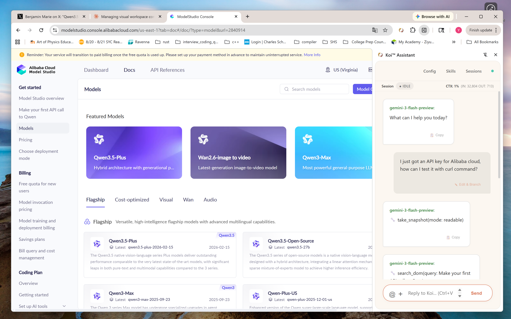
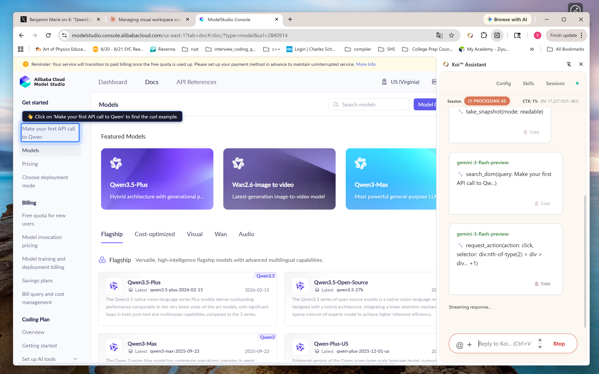

# Koi™ Assistant — works in your browser, the way you do

_Koi™ brings peace to your mind_

[Add to Chrome](https://chromewebstore.google.com/detail/koi-assistant/aedfofodkbfgnjknkjpockkgajemkbng) · [Visit the home page](https://rollingdell.com)

---

Koi™ Assistant is a browser AI assistant. Anything you do with your browser, now AI can assist you on it:

- **Works with your documents:** PDFs, Google Workspace, Microsoft 365, Gmail/Outlook, Docs/Word, Sheets/Excel, Slides/PowerPoint, Calendar, Slack/Chat, and Meet.
- **Visual interaction:** Generate [2D diagrams](https://github.com/rollingdellsw/drawio-skill/blob/main/README.md) from your design notes, build 3D [CAD models](https://github.com/rollingdellsw/freecad-skill/blob/main/README.md) from images, or explore a [gigapixel pathology scan](https://youtu.be/UlqHjMf5eUc) side by side with AI.
- **Automates browser workflows:** Built-in auto-coder — demonstrate a task once in your browser, and the [auto-coder](https://youtu.be/IRM9zQT2aVQ?si=yxYz9gKo6IEuw0rw) generates reliable automation scripts to run on demand.

Koi™ Assistant works with any AI model with vision capability from any provider (through API or your existing subscription), local or cloud.

## You and the AI, on the same screen

Most AI agents run somewhere else. They log into a copy of your accounts with credentials you had to hand over, do the work out of sight, and hand you a result you have no way to check. Koi does the opposite.

**Visual, and interactive.** Hold `Ctrl` and drag to circle anything on the page — a region of a scan, a column of a dashboard, a corner of a diagram — and ask about it. The captured region stays pinned over the page at its original position, and the AI draws back: boxes, arrows, notes, directly on the image. You can interrupt, correct, or take the keyboard at any point.

  
  
   
  <em>Koi does not hijack your mouse. It highlights the next step and lets you take it.</em>

**Your credentials, never copied.** Koi acts inside browser sessions you have already opened. There is no password to share, no service account to provision, no API token sitting in someone's cloud. It inherits exactly your access — including SSO and two-factor — and every action traces back to you, not a bot.

---

## It already knows the tools you live in

Google Workspace and Microsoft 365 out of the box — read and write mail, documents, calendars and spreadsheets. Chat and meetings. Diagrams. Nothing to configure, nothing to connect: if you can see it in your browser, it can work with it.

|                                                       |                                                                                                                                                                            |
| ----------------------------------------------------- | -------------------------------------------------------------------------------------------------------------------------------------------------------------------------- |
| [**Gmail**](./skills/gmail-summarizer)                | Summarize a crowded inbox, draft replies, pull the action items out of a long thread. → [video](https://youtu.be/StrJt2bpy8o)                                              |
| [**Outlook & Microsoft 365**](./skills/microsoft-365) | Read an email together with its PDF, Word and image attachments, then answer questions about all of it. → [video](https://youtu.be/WOCZ1AfRJ5E)                            |
| [**Diagrams**](./skills/drawio-live)                  | Edit a diagram side by side with the AI on a shared draw.io canvas — it moves the boxes, you steer. → [video](https://youtu.be/s1iDvgQNNjo)                                |
| [**CAD**](./skills/freecad-live)                      | Build a machine along with AI, in your browser. → [video](https://youtu.be/m05Ef1b3nBk?si=sjsAq60gbEPP7FbR)                                                                |
| [**Slack**](./skills/slack)                           | Catch up on a channel you have been ignoring for a week and get a summary you can paste back. → [video](https://youtu.be/9kGmSzSxzDw)                                      |
| [**Meeting notes**](./skills/google-meet-note)        | Live notes from a [Google Meet](https://youtu.be/O2-2u8NG9_Q) or [Zoom](./skills/zoom-meeting-notes) call, taken from the captions — no recording bot, no per-minute cost. |
| [**Reports in Sheets**](./skills/db-to-gsheet-report) | Query an internal database and write the formatted result straight into a spreadsheet. → [video](https://youtu.be/u_jCS6eENaQ)                                             |

You can also just ask questions across every tab you have open. → [video](https://youtu.be/P_UsVpNwpXA)

---

## Show it once. It writes the automation itself.

Turn on recording and do the task the way you normally would. Koi watches, then writes the code to do it again — and, crucially, tests that code against the real website, watches it fail, and fixes it until it passes. What you get back is a button you can press, not a script you have to babysit. It keeps improving each time you use it.

Small automations combine into bigger ones. Once you have a few, you can chain them into a single workflow without rebuilding anything.

- **[Flight search, taught in one sitting](https://youtu.be/IRM9zQT2aVQ)** — search Delta once by hand; the AI writes the automation, tests it live, fixes what breaks, and hands back a reusable flight-search tool.
- **[Product research, taught in one sitting](https://youtu.be/0JCELK4EjrI)** — the same recording-to-automation flow on Amazon, including pulling structured details out of every result.

---

## Give it a goal and walk away

Most assistants forget everything once the conversation gets too long. Koi starts a fresh session, carries its notes forward, and keeps working — for hours if needed. You set a spending limit up front; it stops when the job is done or the budget runs out, and tells you which.

- **[One goal, many sessions](https://youtu.be/DOsQnwdI1F4)** — hand over an open-ended task in plain English and let it run. ([topic-runner](./skills/topic-runner))
- **[Building a working web app](https://youtu.be/NjI4QV28FhM)** — pointed at a folder on your own machine, it reads the code, writes changes, runs the tests and iterates, unattended. ([code-topic](./skills/code-topic))

---

## Documents and images too big to read

Thousand-page PDFs. Hundred-megabyte log files. Medical and satellite imagery measured in billions of pixels. Koi works through them in the browser and shows you where the answer came from, so you can check it.

- **[A 1,000-page specification](https://youtu.be/olRSIcH5c1w)** — ask a question against the whole document, get the answer with the page it came from.
- **[A 1,299-page hardware spec](https://youtu.be/TIox-X4Tw4g)** — the kind of document an engineer loses a day to, answered without uploading it anywhere.
- **[A 7.5-billion-pixel image](https://youtu.be/UlqHjMf5eUc)** — pan and zoom a pathology slide with the AI looking at exactly the same pixels you are. ([osd-controller](./skills/osd-controller))

---

## A whole computer, safely handed to the AI

Install a lightweight local service on your computer and AI gets direct, safe access to your local computer — your shell, files, editor tooling, and databases — with no cloud VM fees required.

- **Build and ship software.** Point it at a project and let it write the feature, run the suite, and hand back a reviewable patch.
- **Understand a codebase.** It reads structure the way an editor does — definitions, references, types — instead of guessing from text.
- **Query internal systems.** Pull from your own databases ([postgresql](./skills/postgresql)) and write the results into a spreadsheet or document.
- **Nothing changes without you.** Work is staged for review; discarding a session restores everything exactly as it was.

→ [sandbox-shell](./skills/sandbox-shell)

---

## Use the AI subscription you already pay for

You do not need to buy separate API credits. If you already subscribe to Claude, ChatGPT, Gemini, or Grok, Koi can run on that subscription through a lightweight local proxy.

- **Your existing subscription** — point Koi at a local proxy and it uses the plan you already have. No API key, no per-token bill, no new account. → [how to set it up](./docs/cliproxyapi-howto.md)
- **Direct API keys** — Anthropic, OpenAI, Google, xAI and OpenRouter are supported directly if you prefer to pay per use.
- **Your own hardware** — run a model locally or on an internal server via Llama.cpp, vLLM or MLX. Nothing leaves the network; it works on machines with no internet access at all. → [video](https://www.youtube.com/watch?v=oyxBI8R7hWk)

Koi follows each provider's official API for interleaved thinking and multimodal input, so the full reasoning chain is preserved across turns instead of being flattened between models.

---

## Nothing is sent anywhere you did not choose

Koi™ Assistant is designed with enterprise-grade data security in mind.
There is no Koi cloud. Your conversations, documents and automations are stored in your own browser — sessions in IndexedDB, settings and skills in `chrome.storage.local`. The only thing that ever leaves your machine is what you send to the AI provider you picked — and if you pick a model on your own hardware, not even that.

- **Your own logins.** Koi works inside sessions you have already opened, so it can never see more than you can.
- **You approve the risky steps.** Anything that sends, deletes or changes something asks you first.
- **You can watch it work.** Every action happens on a visible page, not hidden in a datacentre.
- **No telemetry.** No usage statistics, no crash reports, no page content sent to us.

---

## Quick start

1. Install from the [Chrome Web Store](https://chromewebstore.google.com/detail/koi-assistant/aedfofodkbfgnjknkjpockkgajemkbng).
2. Click the Koi icon, open the side panel, and connect your AI — an existing subscription through a [local proxy](./docs/cliproxyapi-howto.md), an API key, or your own server. In a managed company setup, IT [does this for you](./docs/enterprise-deployment.md).
3. Open any page, press `Ctrl` and drag to capture a region, and ask your question.

→ [Full configuration guide](./docs/configuration.md)

---

## For builders

Everything above is built on the same `skill` extension mechanism. Read the [Skill API documentation](./docs/skill_api.md) to build your own skill.
