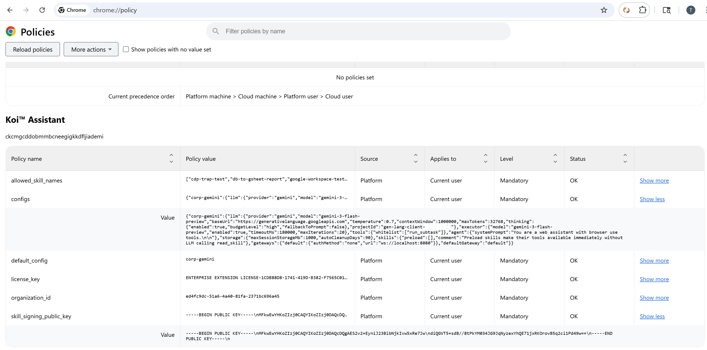

# Koi™ Assistant: Enterprise Deployment & Operations Manual

This document is the complete operations manual for IT administrators deploying and maintaining Koi™ Assistant in a managed enterprise environment.

Enterprise mode activates when a Chrome Managed Policy is detected. Once active, the extension operates exclusively under IT-defined rules: LLM routing is locked to configured endpoints, skills must be cryptographically signed, and end users cannot modify configurations.

**Minimum extension version:** 1.0.9 or later.

---

## Prerequisites

Before starting, ensure you have:

- Google Chrome (or Chromium-based browser with managed policy support)
- OpenSSL installed (for skill signing)
- Node.js v22+ installed (for the `koi-sign.js` tool)
- `jq` installed (for generating config JSON)
- Access to modify Chrome managed policies on your OS (Registry on Windows, JSON files on Linux, plist on macOS)

---

## Phase 1: Licensing

Licenses are purchased and managed through [Polar.sh](https://polar.sh), which handles global tax compliance, invoicing, and seat management.

### 1.1 Purchase Seats

1. Navigate to the Koi™ storefront on Polar.sh and purchase the required number of seats.
2. After checkout, your License Key is displayed on the confirmation page and emailed to the purchasing address.
3. Copy the **full license key string** (e.g., `ENTERPRISE EXTENSION LICENSE-1CDB88D8-1742-419D-B383-F7565C01045B`). The prefix is part of the key — do not use only the UUID portion.

### 1.2 Retrieve Your Organization ID

1. Log into your Polar.sh dashboard.
2. Click your organization name in the sidebar, then select **Settings**.
3. Copy the **Organization ID** (a UUID, e.g., `ed4fc9dc-51a6-4a40-88fa-2371bc696a75`).

### 1.3 Verify the License (Optional)

Confirm the license is valid before deploying to endpoints:

```bash
curl -X POST https://api.polar.sh/v1/customer-portal/license-keys/validate \
  -H "Content-Type: application/json" \
  -d '{
    "key": "ENTERPRISE EXTENSION LICENSE-1CDB88D8-...",
    "organization_id": "ed4fc9dc-..."
  }'
```

A successful response includes `"status":"granted"`. If testing with the Polar sandbox, replace `api.polar.sh` with `sandbox-api.polar.sh`.

---

## Phase 2: LLM Configuration

You control where the extension routes LLM traffic. Two options are available.

### Option A: API Key

For deployments where you distribute a provider API key directly:

```bash
jq -c --arg key "YOUR_REAL_API_KEY" \
  '{"corp-gemini": (.llm.apiKey = $key)}' configs/config.gemini.json
```

Copy the output — this is the value for the `configs` registry entry.

> **Note:** Environment variables (e.g., `${GEMINI_API_KEY}`) are not evaluated within Chrome managed policies. You must use the raw key.

### Option B: GCP Application Default Credentials (Vertex AI)

For deployments where LLM traffic routes through a centralized Google Cloud project with IAM-governed access. No API key is distributed to endpoints.

#### 2B.1 GCP Project Setup

1. Open the [Google Cloud Console](https://console.cloud.google.com) for your corporate GCP project.
2. Enable the **Vertex AI API**: navigate to APIs & Services → Library → search "Vertex AI API" → Enable.

#### 2B.2 IAM Permissions

Each employee using the extension must have these IAM roles on the GCP project:

| Role                     | Purpose                                     |
| ------------------------ | ------------------------------------------- |
| `Vertex AI User`         | Allows `aiplatform.endpoints.predict` calls |
| `Service Usage Consumer` | Allows API quota consumption                |

To grant access:

1. Navigate to IAM & Admin → IAM in the Cloud Console.
2. Click **Grant Access**.
3. Enter the employee's Google Workspace email.
4. Assign both roles listed above.

> **Important:** The extension uses `chrome.identity.getAuthToken()` to obtain an OAuth token. This token proves the user's identity. Google Cloud IAM then checks whether that identity has the required roles on the project. A missing role results in a `403 Forbidden` error.

#### 2B.3 Generate ADC Config

```bash
jq -c --arg pid "your-gcp-project-id" \
  '{"corp-gemini": (.llm.projectId = $pid | del(.llm.apiKey))}' configs/config.gemini.json
```

Copy the output — this is the value for the `configs` registry entry.

#### 2B.4 Verify ADC Auth (Test)

1. Open the extension's background service worker DevTools.
2. Run the OAuth test in the console:

```javascript
chrome.identity.getAuthToken({ interactive: true }, (token) => {
  if (chrome.runtime.lastError) {
    console.error("OAuth Error:", chrome.runtime.lastError.message);
    return;
  }
  console.log("Token:", token ? "PRESENT" : "MISSING");
  fetch(`https://www.googleapis.com/oauth2/v3/tokeninfo?access_token=${token}`)
    .then((r) => r.json())
    .then((info) => {
      console.log("Scopes:", info.scope);
      console.log(
        "Cloud Platform scope:",
        info.scope?.includes("cloud-platform") ? "YES" : "MISSING",
      );
    });
});
```

Expected: Token is present and `cloud-platform` scope is granted.

3. Send a test message in the sidepanel. The console should show:

```
[Gemini:executeStreamChat] Auth State: accessToken=PRESENT, projectId=PRESENT, apiKey=MISSING
[Gemini] Using Vertex AI streaming endpoint with OAuth
```

If you see `accessToken=MISSING, projectId=MISSING`, ensure you are running extension version 1.0.9+.

---

## Phase 3: Chrome Managed Policy Deployment

Chrome reads managed extension policies from the host OS. The extension ID for the production build is `ckcmgcddobmmbcneegigkkdfljiademi`. For sideloaded builds, find the ID at `chrome://extensions`.

### 3.1 Policy Values

Create the following string values under the extension's policy path:

| Name                       | Value                                                             | Notes                                  |
| -------------------------- | ----------------------------------------------------------------- | -------------------------------------- |
| `license_key`              | `ENTERPRISE EXTENSION LICENSE-...`                                | Full string from Polar.sh              |
| `organization_id`          | `ed4fc9dc-...`                                                    | UUID from Polar.sh Settings            |
| `skill_signing_public_key` | `-----BEGIN PUBLIC KEY-----\nMFkw...\n-----END PUBLIC KEY-----\n` | PEM with literal `\n`                  |
| `allowed_skill_names`      | `["google-workspace", "pdf", ...]`                                | JSON array of approved skill names     |
| `default_config`           | `corp-gemini`                                                     | Name of the config profile to activate |
| `configs`                  | `{"corp-gemini":{...}}`                                           | Minified JSON from Phase 3             |

### 3.2 Windows (Registry / GPO / Intune)

Path: `HKEY_CURRENT_USER\SOFTWARE\Policies\Google\Chrome\3rdparty\extensions\<KOI_EXTENSION_ID>\policy`

Create each value above as a **String Value (REG_SZ)**. For GPO/Intune mass deployment, export as a `.reg` file or use ADMX templates.

After setting values, open `chrome://policy` and click **Reload policies** to force a refresh.

### 3.3 Linux

Create a JSON file at `/etc/opt/chrome/policies/managed/koi-enterprise.json`:

```json
{
  "3rdparty": {
    "extensions": {
      "<EXTENSION_ID>": {
        "license_key": "ENTERPRISE EXTENSION LICENSE-...",
        "organization_id": "ed4fc9dc-...",
        "skill_signing_public_key": "-----BEGIN PUBLIC KEY-----\nMFkw...",
        "allowed_skill_names": ["google-workspace", "pdf"],
        "default_config": "corp-gemini",
        "configs": {
          "corp-gemini": {
            "llm": {
              "provider": "gemini",
              "projectId": "gen-lang-client-...",
              "model": "gemini-3-flash-preview",
              "baseUrl": "https://generativelanguage.googleapis.com",
              "temperature": 0.7,
              "contextWindow": 1000000,
              "maxTokens": 32768
            }
          }
        }
      }
    }
  }
}
```

Set file permissions to `644` owned by `root`. Restart Chrome.

### 3.4 macOS

Use a `.mobileconfig` profile or MDM to push a `com.google.Chrome` managed preference containing the same structure as the Linux JSON. Deploy via Jamf, Mosyle, or similar MDM solutions.

---

## Phase 4: Validation Checklist

After deployment, verify each layer in order:

### 4.1 Policy Loaded

Navigate to `chrome://policy/`. Under "Koi™ Assistant", confirm all six values appear with Status **OK**.



### 4.2 License Activation

Open the background service worker DevTools (`chrome://extensions` → service worker link). Look for:

```
[EnterpriseLicense] Activation successful, instance: <uuid>
```

If activation fails, check the console for the specific error (network, invalid key, org mismatch).

### 4.3 Config Lockdown

Open the sidepanel Settings. The config dropdown should show your profile as `corp-gemini (managed)`. Users must not be able to edit, add, or delete configurations.

### 4.4 Skill Signature Verification

Install an approved signed skill. Background console should log:

```
[SkillStorage] Signature verified for skill: <name>
```

When the agent uses the skill, look for:

```
[BrowserSkillResolver:resolve] Skill "<name>" signature verified OK
```

### 4.5 LLM Routing

Send a test message. In the sidepanel console, verify the auth state line matches your deployment:

**API Key deployment:**

```
Auth State: accessToken=MISSING, projectId=MISSING, apiKey=PRESENT
```

**ADC deployment:**

```
Auth State: accessToken=PRESENT, projectId=PRESENT, apiKey=MISSING
[Gemini] Using Vertex AI streaming endpoint with OAuth
```

Check the Network tab to confirm requests go to `us-central1-aiplatform.googleapis.com` (ADC) or `generativelanguage.googleapis.com` (API key).

---

## Phase 5: Skill Signing

Enterprise mode requires all installed skills to be cryptographically signed (ECDSA P-256) by IT. Unsigned or tampered skills are blocked at both install time and resolve time.

### 5.1 Generate the Signing Key Pair

Keep the private key secure within your CI/CD pipeline or secrets manager.

```bash
# Generate private key
openssl ecparam -name prime256v1 -genkey -noout -out skill-signing-key.pem

# Extract the public key (this goes into Chrome policy)
openssl ec -in skill-signing-key.pem -pubout -out skill-signing-pubkey.pem
```

### 5.2 Format the Public Key for Policy

The public key must be a single-line string with literal `\n` characters for the Chrome policy value:

```bash
cat skill-signing-pubkey.pem | perl -pe 's/\n/\\n/g'
```

Output example:

```
-----BEGIN PUBLIC KEY-----\nMFkwEwYHKoZIzj0C...\n-----END PUBLIC KEY-----\n
```

### 5.3 Sign a Skill

Use the provided `koi-sign.js` script (located at `tools/koi-sign.js`). This script uses the same V8 text encoding as the browser's Web Crypto API, ensuring byte-for-byte hash parity.

```bash
node tools/koi-sign.js \
  --pub-key skill-signing-pubkey.pem \
  --priv-key skill-signing-key.pem \
  skills/<target-skill-folder>
```

The script outputs a `skill.sig` file into the skill folder and verifies the signature immediately. Distribute the skill folder with this file included.

### 5.4 Verify Signing (After Full Configuration)

**Positive path:** Install the signed skill via the Skills UI. Background console should log:

```
[SkillStorage] Signature verified for skill: <skill-name>
```

**Negative path:** Modify any character in the skill's script files and attempt installation. The UI should block with a signature verification failure.

### 5.5 Sign a Global Guardrail File

Enterprise environments must also secure global configuration scripts. `koi-sign.js` can sign standalone `.js` files (like `guardrails.js`).

Instead of writing a separate `.sig` file, the script will append the signature directly to the end of the Javascript file as a comment: `// @koi-signature: <base64>`.

```bash
node tools/koi-sign.js \
  --pub-key skill-signing-pubkey.pem \
  --priv-key skill-signing-key.pem \
  configs/guardrails.js
```

---

## Phase 6: Skill Distribution

Signed skills must be delivered to employee browsers. Supported distribution methods:

1. **Bundled with extension:** Place signed skill folders in the extension's `skills/` directory before packaging. Skills are available immediately after install.
2. **Skills UI upload:** Employees open the Skills Manager in the sidepanel and import a skill folder (containing `skill.sig`). The signature is verified at install time.
3. **Preload via config:** Add skill names to the `skills.preload` array in the config to auto-load them on session start (skills must already be installed).

---

## Troubleshooting

| Symptom                                          | Console Evidence                                       | Cause                                                           | Fix                                                                                                       |
| ------------------------------------------------ | ------------------------------------------------------ | --------------------------------------------------------------- | --------------------------------------------------------------------------------------------------------- |
| Extension shows "Configure Local Mode"           | `Enterprise license not activated`                     | License key or org ID invalid/missing in policy                 | Verify `license_key` and `organization_id` at `chrome://policy`                                           |
| Config dropdown shows "default (not configured)" | `loadConfig` log missing enterprise                    | Managed policy not detected                                     | Check policy path matches extension ID; reload policies                                                   |
| LLM calls fail with 401                          | `Gemini API requires either an API key or OAuth token` | Neither API key nor projectId in config                         | Check `configs` JSON has `apiKey` or `projectId`                                                          |
| `accessToken=MISSING` with ADC                   | `Auth State: accessToken=MISSING, projectId=MISSING`   | Extension version < 1.0.9 (authService lost during reconfigure) | Update to 1.0.9+; verify build includes `LLMClient` authService fix                                       |
| `accessToken=MISSING` but `projectId=PRESENT`    | Token retrieval returns null                           | `chrome.identity.getAuthToken` failed silently                  | Run OAuth test script from §3B.5; check `chrome://identity-internals`                                     |
| LLM calls fail with 403                          | `Gemini API error (403)`                               | User lacks IAM roles on GCP project                             | Grant `Vertex AI User` + `Service Usage Consumer` roles                                                   |
| Skill install blocked                            | `Signature verification failed`                        | Skill was modified after signing, or wrong public key in policy | Re-sign the skill; verify `skill_signing_public_key` matches the private key used                         |
| Skill install blocked                            | `Skill not in allowed list`                            | Skill name not in `allowed_skill_names`                         | Add the skill name to the JSON array in policy                                                            |
| Thinking/reasoning not working                   | No `[Gemini 3] Thinking enabled` log                   | `thinking` config field mismatch                                | Ensure config uses `budgetLevel` (not `budgetTokens`): `"thinking":{"enabled":true,"budgetLevel":"high"}` |

---

## License Lifecycle

| Event                    | Behavior                                                                       |
| ------------------------ | ------------------------------------------------------------------------------ |
| License valid            | Silent activation on extension install/startup                                 |
| License expired          | Activation fails on next startup; extension shows enterprise error             |
| License revoked in Polar | Next validation attempt fails; existing active sessions continue until restart |
| Seat limit reached       | Activation fails with limit error; revoke unused instances in Polar dashboard  |

To revoke a specific instance, use the Polar API or dashboard to deactivate the license key. The extension will fail activation on its next startup.

---

## Security Model Summary

| Layer                | Mechanism                                                  |
| -------------------- | ---------------------------------------------------------- |
| LLM traffic routing  | Config locked via managed policy; user cannot edit         |
| Skill integrity      | ECDSA P-256 signatures verified at install + resolve time  |
| Authentication (ADC) | `chrome.identity.getAuthToken` → Google IAM enforces roles |
| License enforcement  | Polar.sh activation on startup; no activation = no agent   |
| Config immutability  | Enterprise mode disables save/edit/add/delete in UI        |
```
