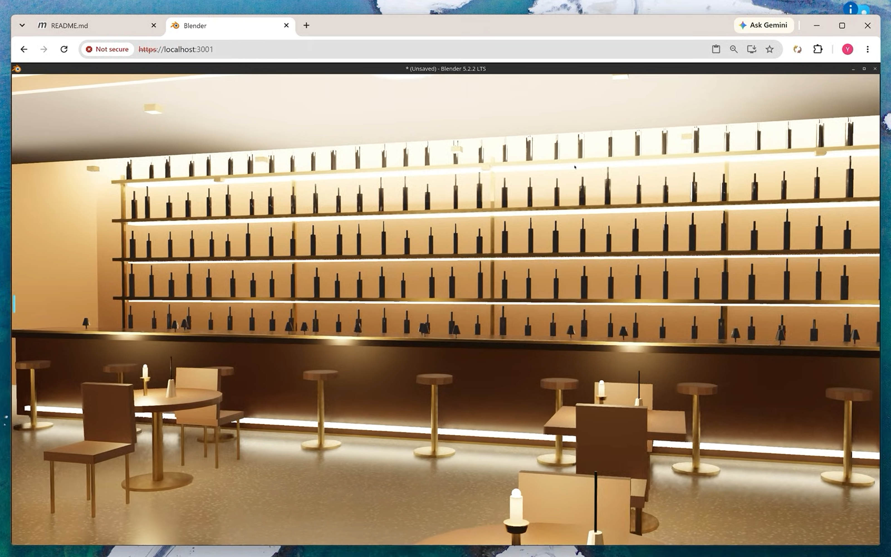

# blender-live — Human/AI Co-Editing of a Live Blender Session for Koi™ Assistant

`blender-live` lets you and the AI work on the same Blender scene at the same
time. You keep the mouse; the model reads the scene, measures it, edits it
through Python, and looks at its own work through the viewport.

Blender runs in a rootless Podman container and is streamed to a browser tab
over WebRTC, the same deployment `freecad-live` uses. Koi sits in the side panel
next to it, so the thing you point at and the thing the model edits are the same
pixels.

Click to watch a video demo:
[](https://youtu.be/LGD80ZWot_s)


---

## 1. Why run Blender from Koi

`blender-mcp` already works in Claude Desktop and Cursor. Five things change
when the same server runs behind Koi.

**Your references are already in tabs.** The most common real request is "make
this" — pointing at a product photo, a reference sheet, a dimensioned drawing
in a PDF. In a desktop client that means downloading and attaching files. In
Koi it means holding `Ctrl` and dragging a region on the page.

**So is the viewport.** Blender is one of those tabs. `Ctrl`-drag a region of
the live 3D view and the model gets the viewport as it is right now, rather than
a render it had to ask for and wait on. "This edge here" becomes a drag instead
of a paragraph — and that is something `get_viewport_screenshot` cannot do for
you even though it works fine (§5a): a capture the model requested shows it the
whole viewport, while one you dragged shows it _which part you meant_.

**The vision loop closes both ways.** Koi captures a region and the AI draws
back on the same pixels — boxes, arrows, notes. A desktop client can hand you a
viewport screenshot; it cannot let you point at one.

**Long, image-heavy sessions on the plan you already pay for.** Modelling burns
renders. Koi runs on an existing Claude/ChatGPT/Gemini subscription through a
local proxy, on a direct API key, or on a model on your own hardware.

**It composes with your other skills.** `freecad-live` exports STEP and Blender
turns it into something presentable. A database query becomes a 3D
visualization. Two skills in one session is not available to anyone running
`uvx blender-mcp` from a terminal.

On top of that, the skill adds a turn protocol upstream has no notion of: a
scene digest diffed each turn so a human edit is never silently overwritten, an
explicit undo checkpoint per agent step, and `koi_origin` stamping so the model
can tell its work from yours. None of it is enforced — see §5.

---

## 2. Architecture

```
Chrome tab ──WebRTC (Selkies)──▶ :3001 ─┐   rootless podman container
                                         │
Koi side panel ──ws──▶ Koi Gateway ──────┼──▶ blender-mcp ──tcp:9876──▶ Blender + addon
   (extension)          (host)   podman exec -i     (in container)       (one GUI process)
```

Same three pieces as [freecad-live](../freecad-live/README.md): a LinuxServer image streaming a real
desktop to a browser tab, a small server living inside that GUI process, and
the skill on the Koi side.

The difference is the middle piece. `freecad-live` ships `koi_bridge.py`
because FreeCAD has no in-process endpoint. Blender's already exists and is
upstream's own addon: it opens a socket inside the GUI process and marshals
every command onto the main thread through `bpy.app.timers`. There is nothing
to write — only to reach. Nothing in this skill is forked from upstream, and
the only file it puts inside the container is a startup script that enables the
addon and opens the socket, so nobody has to be sitting at the GUI on first
boot.

| Port | What                   | Published on      |
| ---- | ---------------------- | ----------------- |
| 3001 | the stream, TLS        | `127.0.0.1` only  |
| 3000 | the stream, plaintext  | `127.0.0.1` only  |
| 9876 | the addon's MCP socket | **not published** |

**What persists.** `~/blender-stream/workspace` is bind-mounted at
`/workspace` and is the only path inside the container that is a real directory
on your machine. Everything else lives in the container's own filesystem and is
gone the next time the image is bumped. A save that reports success and
evaporates is worse than one that fails, so `/workspace/` is where the skill
tells the model to write everything — and since nothing enforces that (§5), it
is the first thing to check when a file goes missing.

---

## 3. Verified setup

| Component        | Version                                                        |
| ---------------- | -------------------------------------------------------------- |
| Host             | Windows 11 + WSL2, Ubuntu 22.04                                |
| Container engine | Podman 4.9.3+ rootless (Docker works; substitute the commands) |
| Image            | `docker.io/linuxserver/blender`, Selkies/WebRTC base           |
| Blender          | 5.2.1 LTS (last verified); 4.5.0 LTS also exercised            |
| Addon            | MCP for Blender 1.6 (protocol 5)                               |
| Server           | `blender-mcp` via `uv`, Python 3.11, 28 tools, in-container    |
| Display          | Selkies WebRTC in a Chrome tab, CPU rendering by default       |
| Skill            | `blender-live` 3.0.0 (`SKILL.md` front matter)                 |

---

## 4. Setup

Everything runs on the Linux host. There is no host-side Blender and no
host-side `uv`: both live in the container.

### Step 0 — Podman, rootless

```bash
podman --version                       # 4.9.3 or newer
grep $USER /etc/subuid /etc/subgid     # must print two lines
```

If the second command prints nothing:

```bash
sudo usermod --add-subuids 100000-165535 --add-subgids 100000-165535 $USER
podman system migrate
```

### Step 1 — Pick the image, and pin it

```bash
podman pull docker.io/linuxserver/blender@sha256:ab34fa7f022bf73ecb6d60df4464c06d3b9948ce8638c70462954195b9632968
export KOI_BLENDER_IMAGE='docker.io/linuxserver/blender@sha256:ab34fa7f022bf73ecb6d60df4464c06d3b9948ce8638c70462954195b9632968'
```

### Step 2 — Bring up the container

```bash
cd skills/blender-live
./container/koi-blender-up.sh
```

Idempotent — re-run it after an image bump, a bad edit, or a reboot.

**Verify**

```bash
podman ps --filter name=koi-blender
podman logs koi-blender | grep -i 'koi_blender_autostart\|BlenderMCP'
```

Expected:

```bash
koi_blender_autostart: listening on 127.0.0.1:9876 (addon blender_mcp)
BlenderMCP server started on 127.0.0.1:9876
```

### Step 3 — Open the stream

```bash
grep -E 'CUSTOM_USER|PASSWORD' ~/blender-stream/stream.env
```

Browse to **`https://localhost:3001`** — `https`, and only 3001; 3000 is
plaintext and exists for reverse proxies. The certificate is self-signed, so
Chrome warns: **Advanced → Proceed to localhost (unsafe)**. Log in with those
two values.

### Step 4 — Register the server with the Koi Gateway

```bash
podman ps --filter name=koi-blender      # Confirm the container is up first
systemctl --user restart koi-gateway     # then the gateway
journalctl --user -u koi-gateway -n 30
```

Expected output:

```bash
koi-gateway[47398]: ║  Available MCP servers:                                  ║
koi-gateway[47398]: ║    • blender                                             ║
```

### Step 5 — Smoke test the whole chain

```bash
node tools/gateway/koi-blender-smoke.mjs
```

Expected result:

```bash
1/5 PASS   transport        28 tools registered
2/5 PASS   blender socket   scene "Scene", 3 objects
3/5 PASS   stdout capture   5.2.1 LTS build 9e2066aef7ef, 3 objects
4/5 PASS   image channel    image block, 133844 b
5/5 PASS   stream           https://localhost:3001 answers

All 5 passed — chain is live.

```

### Step 6 — Install the skill and run preflight

Install `blender-live` through the Koi Assistant's Skills UI, then input this from Koi's user message box:

```
/skill blender-live/scripts/connect.js --full-auto
```

**Verify** — the result carries `success: true`.

### Step 7 — First real task

Run the skill from Koi Assistant's Skills UI, add this prompt into the skill run's `Additional Instructions (Optional)` input box:

> Build a phone stand for a phone 158 × 75 × 8.5 mm, screen facing me. Cradle lip 12 mm tall,
> back rest angled 60° from horizontal, base deep enough that it can't tip when the phone leans back,
> wall thickness 3 mm throughout, 2 mm fillet on every edge a hand touches.
> Give me the base footprint and the centre of mass in X/Y when the phone is in it,
> and tell me your tipping margin. Save as `/workspace/koi_export/phone-stand.blend` and export an STL beside it.

### Step 8 — Survive a reboot (optional)

```bash
loginctl enable-linger $USER
mkdir -p ~/.config/systemd/user
cat > ~/.config/systemd/user/koi-blender.service <<'EOF'
[Unit]
Description=Koi Blender (Selkies WebRTC streaming container)
After=network-online.target
Wants=network-online.target

[Service]
Type=oneshot
RemainAfterExit=yes
ExecStart=/usr/bin/podman start koi-blender
ExecStop=/usr/bin/podman stop -t 10 koi-blender

[Install]
WantedBy=default.target
EOF
systemctl --user daemon-reload
systemctl --user enable --now koi-blender.service
```

`podman start` on the container the setup script already built, rather than a
second `podman run` that would have to repeat every flag and then drift from
it. The gateway still has to be restarted after this unit comes up; if you care
about boot order, add `Requires=koi-blender.service` and
`After=koi-blender.service` to the gateway unit.

---

## 5. What is not enforced

The container is the security boundary, and that is the whole of it. Inside the
session there are no blocks, no budgets and no safe mode: the skill ships a
scene digest, a set of reminders and a guardrail that only **annotates** results,
never refuses a call. The addon's socket runs arbitrary Python with no
authentication, which is exactly why 9876 is not published and the MCP server is
spawned inside the container's own network namespace.

So the protocol in §6 is a protocol, not a mechanism. Specifically, nothing
stops the model from:

- **writing outside `/workspace/`**, where the file disappears on the next image
  bump while the save still reports success. First thing to check when a file
  goes missing.
- **skipping `undo_push` or `koi_origin`**, which leaves your Ctrl+Z jumping
  over a whole batch and leaves you unable to tell its work from yours.
- **quitting, resetting, or loading another `.blend` over unsaved work.** No
  undo step covers these. `SKILL.md` tells it not to unless you asked in that
  turn; take the mouse and do it yourself, it is two seconds in the GUI.
- **spending your API key.** The Hyper3D and Hunyuan generators bill it, and
  Poly Haven, Sketchfab and Poly Pizza downloads leave the machine even though
  they are free. The model is told to ask first and name the service.

None of that is a gap to be closed later. A session that quietly routes around a
broken call produces a correct-looking scene and an untrue report, so `SKILL.md`
asks for the opposite: say which call failed, and let the bug report be the
output. That is currently the most valuable thing a session here produces.

---

## 6. The turn protocol

Every turn: **read, edit, verify.**

- **Read** — run the digest from `SKILL.md` through `execute_blender_code`. It
  reports selection, active object, transforms, modifier stacks, collections and
  `koi_origin`. It deliberately touches **no mesh data at all** — no materials
  walk, no per-vertex hash; those were what severed the socket, and topology is
  now a separate per-object opt-in probe. Diff it against last turn's copy to
  see what the human changed.
- **Edit** — data API where possible; `bpy.context.temp_override(...)` when an
  operator is unavoidable, because the bridge runs code from a timer callback
  with no 3D viewport in context. Stamp new objects with `koi_origin`. End every
  batch with `bpy.ops.ed.undo_push(message="koi: ...")` — Blender's undo is
  operator-based and direct `bpy.data` mutation pushes nothing.
- **Verify** — `get_viewport_screenshot` works, and is the right call for
  composition, orientation, or "did that modifier do what I meant".
  `Ctrl`-drag the live viewport yourself when the question is _which_ part. And
  a picture never proved a bevel is 3 mm — only `dimensions`, `bound_box`,
  `matrix_world`, a bmesh measurement, or
  `bpy_extras.object_utils.world_to_camera_view` for framing.

`SKILL.md` carries the canonical snippets the model is expected to paste:
`_view3d()` for the operator context a timer callback does not have, `_frame()`
for viewport framing and clip planes at millimetre scale, `_mass_props()` for
volume, centre of mass and a watertightness cross-check, and the export rule
`global_scale = scale_length × 1000` with `use_scene_unit=False`, which is what
keeps an STL out of the 1000× trap. Each one arrived from a session that hit the
problem first; if a session here finds another, that is where it goes.

## Appendix 4a. Remote GPU Host Setup (ROCm / CUDA via SSH)

To run Blender on a remote dedicated GPU machine (e.g. dual AMD ROCm or NVIDIA GPUs) while keeping the Koi Gateway and Chrome extension local:

```
[Local Chrome & Gateway]
   │  https://localhost:3001 (WebRTC Stream via SSH tunnel)
   │  ws://localhost:8080 (Koi Extension WebSocket)
   ▼
[Local Host (WSL2 / Linux)]
   └── koi-gateway (keeps running locally)
         │
         ├── ssh -N -L 3001:127.0.0.1:3001 ──▶ [Remote GPU Host]
         │                                         ├── Port 3001: Selkies WebRTC Stream
         └── ssh -T remote-host podman exec ─▶ └── Container: koi-blender
                                                       ├── /dev/kfd + /dev/dri (ROCm/HIP)
                                                       └── blender-mcp (tcp:9876)
```

### 1. On the Remote GPU Machine

Ensure your user has access to GPU device nodes:

```bash
sudo usermod -aG render,video $USER
```

Pass the GPU device nodes (`/dev/kfd` and `/dev/dri` for AMD ROCm; or `--device nvidia.com/gpu=all` for NVIDIA) into the container setup script:

```bash
cd skills/blender-live
export KOI_BLENDER_GPU="--device /dev/kfd --device /dev/dri --group-add keep-groups"
./container/koi-blender-up.sh
```

_(Note for Blender 5.2+: If the addon doesn't bind automatically on startup, open `https://localhost:3001` in browser, go to **Edit → Preferences → Add-ons**, enable **Interface: MCP for Blender**, press **N** in the 3D viewport, and click **Start Server** under the Blender MCP tab)._

### 2. On the Local Machine (WSL2 / Linux)

Set up passwordless SSH:

```bash
ssh-copy-id $USER@<remote-host-ip>
```

Point `gateway-config.json`'s `blender` server to the remote container over SSH stdio:

```json
    "blender": {
      "command": "ssh",
      "args": [
        "-T",
        "-o", "BatchMode=yes",
        "user@<remote-host-ip>",
        "podman", "exec", "-i",
        "-e", "DISABLE_TELEMETRY=true",
        "-e", "BLENDER_HOST=127.0.0.1",
        "-e", "BLENDER_PORT=9876",
        "koi-blender",
        "/config/.local/bin/blender-mcp"
      ]
    }
```

Restart the gateway and forward the WebRTC stream port:

```bash
systemctl --user restart koi-gateway
ssh -N -L 3001:127.0.0.1:3001 user@<remote-host-ip>
```

### 3. Verify

Run the smoke test on the local machine:

```bash
node tools/gateway/koi-blender-smoke.mjs
```

Expected:

```
1/5 PASS   transport        31 tools registered
2/5 PASS   blender socket   scene "Scene", 3 objects
3/5 PASS   stdout capture   5.2.2 LTS build ..., 3 objects
4/5 PASS   image channel    image block, ...
5/5 PASS   stream           https://localhost:3001 answers

All 5 passed — chain is live.
```

## Appendix Step 7.1 The prompt for demo video

> Build a moody, high-end luxury restaurant and cocktail bar interior in Blender
> via Python. Target: dark, warm, high-contrast — near-black room carried by warm
> 2800K fixtures. NOT evenly lit; deep shadow is the point.
>
> ## Working method (read first)
>
> - Build in 6-8 small `execute_blender_code` batches, not one call. Wrap every
>   snippet in try/except + `json.dumps(..., default=str)`.
> - Stamp `obj["koi_origin"]="agent"` and end each batch with `bpy.ops.ed.undo_push`.
> - Save to `/workspace/koi_export/luxury_bar.blend` after the geometry batches,
>   before any lighting tuning. Re-save when I approve a look.
> - Screenshot at max_size=700 after: geometry, first lighting pass, final. Report
>   measured numbers (dimensions, world_to_camera_view margins), not impressions.
>
> ## 1. Architecture (metres, Z-up)
>
> Room 18 × 22.4, ceiling 4.2, floor at z=0.
>
> - Bar: 12 m long at y=6.0. Fluted dark-walnut body, polished black marble top
>   (roughness 0.15), brass foot rail, 9 leather stools.
> - Back bar: wall at y=7.9. Five glass shelf tiers at z=0.95/1.55/2.15/2.75/3.35,
>   brass standards + lip. ~170 bottles, randomized height/radius/liquid colour,
>   6 liquid variants.
> - Dining: 20 tables in a grid (alternate square/round walnut), 40 thin-leg
>   leather chairs, brass candle holder + emissive flame + ceramic bud vase each.
> - Lounge: reception desk at y=-12.3, 8 walnut pillars at x=±6.2, slatted timber
>   screens at x=±7.9.
> - Ceiling: two-tier drop with perimeter cove channel; ~33 walnut baffle fins
>   spanning the dining area, centred z=3.48, depth 0.34.
>
> ## 2. Lighting — these exact pitfalls cost a whole session, avoid them
>
> - **Downlights go at z=3.24, BELOW the baffle underside (3.31).** Above it they
>   are occluded and the room renders black.
> - **Put 6 spots down the central aisle at x=0.** If every downlight sits over a
>   table, the aisle is a black corridor.
> - **Set `eevee.fast_gi_distance = 12.0`.** It defaults to 0.0, which means zero
>   indirect bounce — the room goes black and no amount of exposure fixes it.
> - **Set `clamp_surface_indirect = 10.0`, not 0 and not 8.** 0 gives fireflies;
>   8 crushes the bounce you just created.
> - **Keep raytracing ON.** The polished terrazzo floor (roughness 0.25) is a
>   specular surface — with SSR off it renders pure black regardless of light.
> - Emission strengths: cove 18, shelf glow 12, flame 90. Higher blows the back
>   wall to white.
> - Disable shadows on the 20 flame point-lights and the big area fills; they
>   contribute grain, not light.
> - Exposure ~1.2-1.5, world background strength 0.35, Filmic.
>   Do NOT lift world strength above ~0.5 to brighten — it flattens to grey.
>   Do NOT raise material albedo to brighten — fix the light instead.
>
> ## 3. Materials
>
> Keep procedural `Detail` ≤ 1-2 on all wave/noise/voronoi nodes, and use FLAT
> colour on ceiling baffles, slats and the ceiling slab. High-detail procedurals
> alias into what looks exactly like render noise, especially at grazing angles,
> and no amount of sampling removes it.
>
> - Marble black: rough 0.15, metallic 0.35, base ~(0.02,0.02,0.024)
> - Terrazzo: rough 0.25, voronoi scale ~28, base ~(0.055,0.05,0.046)
> - Dark walnut: base ~(0.048,0.022,0.011), rough 0.4, bump ≤ 0.05
> - Glass: transmission 1.0, IOR 1.45, rough 0.05
>
> ## 4. Camera — 80 frames @ 24 fps, seamless loop
>
> - **Off-axis diagonal sweep, not a centre dolly.** A path at x=0 with zero yaw
>   renders as a flat symmetrical elevation. Start ~(-5.0,-11.9,2.75), sweep to
>   ~(2.4,-2.6,1.75), return to start at the last frame.
> - **Aim with a TRACK_TO constraint on an animated empty**, never hand-entered
>   euler angles. Lens breathes 22 → 32 mm.
> - DOF off, or f/8 minimum. f/2.2 on a wide lens blurs the whole foreground.
> - Verify with `world_to_camera_view` that the bar is in frame and in front of
>   the lens at ≥5 sampled frames, and that the camera clears the walls and the
>   x=±6.2 pillars. Report the clearances.
> - On Blender 5.x, `action.fcurves` does not exist (slotted Actions). Walk
>   `action.layers → strips → channelbag(slot).fcurves` to set Bezier handles.
>
> ## 5. Viewport
>
> MATERIAL shading, scene lights + world on, overlays and gizmos off, locked to
> camera view. Call `view3d.view_center_camera()` and set
> `camera.passepartout_alpha = 1.0` — otherwise the view sits zoomed out past the
> render border and shows the room around the frame.
> `screen.screen_full_area(use_hide_panels=True)` for a clean stream.
>
> ## 6. Playback — tell me the real number, don't promise real-time
>
> Start `screen.animation_play()`. Then MEASURE actual fps (time + frame delta in
> two separate calls, with nothing else in between — a save or a screenshot
> blocks the main thread and poisons the measurement).
>
> Expect ~1 fps. In this container the bottleneck is GPU draw + stream encoding,
> NOT scene complexity — depsgraph evaluation is ~0.6 ms/frame. Stripping glass,
> raytracing and shadows does not help, so do not degrade the look chasing speed.
> State the measured fps and let me choose:
> (a) `sync_mode='FRAME_DROP'` — correct wall-clock timing, visibly skips
> (b) `sync_mode='NONE'` — every frame drawn, loop runs ~4x slow
> (c) PNG sequence to /workspace/koi_export/frames/ for external encoding
> `frame_step` is ignored during playback — to change speed, scale the keyframes.
> MP4 is unavailable on this build: `image_settings.file_format='FFMPEG'` raises
> even though the enum lists it. Don't retry it; go straight to PNG.
