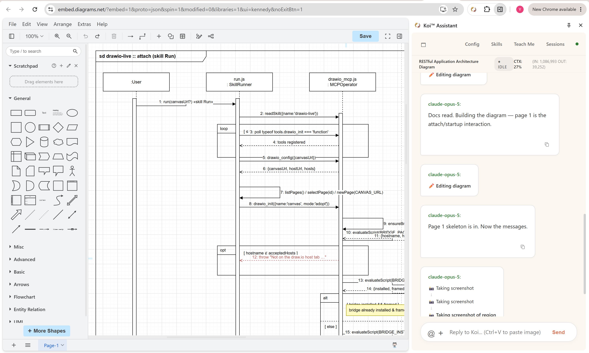
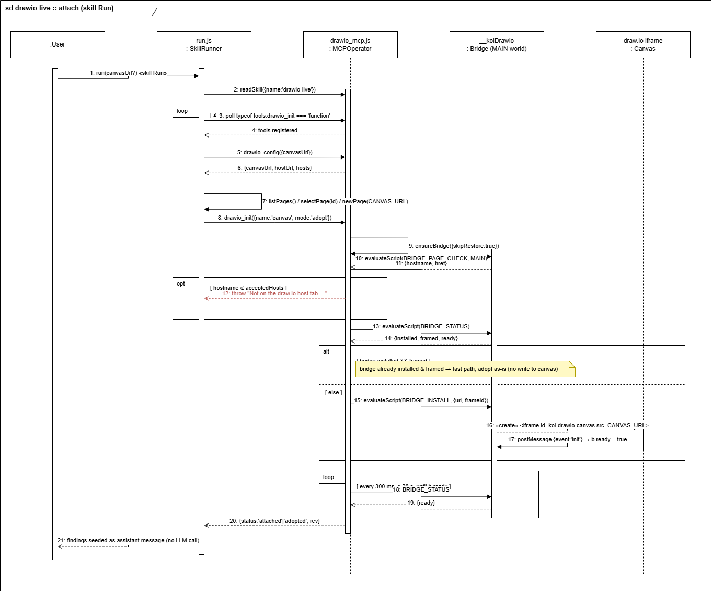

# drawio-live — Turn-Based Diagram Co-Editing Skill

`drawio-live` enables turn-based human/AI co-editing of draw.io diagrams directly inside a live browser tab. The AI interacts with the canvas through structured XML mutations and layout operations, while the human user edits freely in the GUI. Both sides stay in sync through automated turn boundaries and text-based delta diffing.

<div align="center">
  
  <br>
  
  <br>
  <em>Koi helps you to understand a project in a highly efficient way.</em>
</div>

---

## 1. Architecture & Mental Model

### Components Overview

```
┌─────────────────────────────────────────────────────────────────────────┐
│ Browser Tab (Host Window)                                               │
│                                                                         │
│  ┌──────────────────────────┐         ┌────────────────────────────┐    │
│  │ Host Tab [MAIN World]    │         │ Koi AI Assistant           │    │
│  │  __koiDrawio Bridge:     │         │  LLM Session               │    │
│  │  · <iframe> contentWindow│         │  drawio_* MCP Tools        │    │
│  │  · postMessage IPC log   │         └─────────────┬──────────────┘    │
│  │  · monotonic event queue │                       │                   │
│  │  ┌────────────────────┐  │         ┌─────────────▼──────────────┐    │
│  │  │ <iframe> 100vw/vh  │  │         │ MCP Server                 │    │
│  │  │ embed.diagrams.net │  │         │  mcp/drawio_mcp.js         │    │
│  │  │  ?embed=1          │  │◀──────▶ │  · Session state (base,    │    │
│  │  │  &proto=json       │  │ evaluate│    history, rev)           │    │
│  │  │                    │  │ Script  │  · Canonical XML differ    │    │
│  │  │ draw.io editor UI  │  │         │  · Ops mutation engine     │    │
│  │  └────────────────────┘  │         │  · ELK layout & router     │    │
│  └──────────────────────────┘         └────────────────────────────┘    │
│         ▲                                                               │
│         │ postMessage JSON IPC (local  in-memory protocol)              │
└─────────────────────────────────────────────────────────────────────────┘
```

- **Canvas (`<iframe>`)**: Full draw.io web editor loaded in embed mode (`?embed=1&proto=json`). Provides the full interactive GUI for human edits.
- **Bridge (MAIN World Script)**: Installed in the host tab by `drawio_init`. Intercepts and logs `postMessage` JSON RPC events between the host window and the draw.io iframe.
- **MCP Operator (`mcp/drawio_mcp.js`)**: Manages session state, XML canonicalization, LCS line diffing, op validation/linting, ELK auto-layout, and the LLM tool surface.
- **Turn Enforcement & Guardrails (`scripts/pre_send.js`, `scripts/guardrail.js`)**: Enforces `drawio_sync()` calling order at turn boundaries (`drawio_begin_turn`), tracks mid-turn canvas drift, and limits image token usage.

---

## 2. Privacy & Data Flow

### Is Diagram Data Sent Over the Network?

**No. Your diagram data stays strictly local in browser memory.**

1. **Static Web Assets**: The browser fetches the editor UI assets (HTML, JS, CSS, icon libraries) from `embed.diagrams.net` (or a local server).
2. **Local IPC via `postMessage`**: Diagram content (XML, shapes, edges, labels) is transferred locally between the parent window and the iframe using HTML5 `window.postMessage()`.
3. **Zero Remote Storage**: Neither draw.io/JGraph nor any remote server receives or stores diagram payloads. Diagram mutations, diffing, and XML processing take place entirely inside your browser and local MCP process.

---

## 3. Turn-Based Co-Editing Workflow

Co-editing follows a **Sync → Edit → Verify** loop for every turn:

```
        HUMAN TURN (unbounded)                    AI TURN (one prompt)
 ┌──────────────────────────────┐   prompt   ┌──────────────────────────────┐
 │ User edits canvas freely     │  ───────▶  │ 1. SYNC: drawio_sync()       │
 │ (drag, style, add, delete,   │  (text ±   │    → adopts live canvas      │
 │  undo, redo, revert...)      │  annotated │    → generates userDiff      │
 │                              │   capture) │ 2. EDIT: drawio_ops()        │
 │ Canvas = Ground Truth        │            │    → targeted XML mutations  │
 │                              │  ◀───────  │ 3. VERIFY: lint → route →    │
 │ User views updated canvas    │   reply +  │    takeScreenshot()          │
 └──────────────────────────────┘   canvas   └──────────────────────────────┘
```

1. **Sync (`drawio_sync()`)**: Mandatory turn opener. Exports live canvas XML, canonicalizes it, adopts it as the editing base, and returns `userDiff` reporting what the user changed.
2. **Edit (`drawio_ops({ops})` / `drawio_apply({xml})`)**:
   - **`drawio_ops`**: Preferred for targeted edits (`add_node`, `add_edge`, `set_label`, `set_edge_label`, `set_edge_points`, `set_style`, `move_by`, `align`, `distribute`, `adopt`, etc.).
   - **`drawio_apply`**: Full-document XML rewrite for major structural overhauls.
3. **Layout & Routing**:
   - **`drawio_route()`**: Runs libavoid obstacle-avoiding orthogonal edge routing. **Moves no shapes.**
   - **`drawio_arrange()`**: Runs ELK layout engine to re-place shapes.
4. **Verify**: Structural linting (`lint` array) reports box clipping and edge collisions. Visual verification is done via `takeScreenshot()`.

---

## 4. Choosing a draw.io Instance

The editor URL is configuration, not code. The public editor, a local server,
and a corporate self-host are the same case with a different origin, and
nothing in the skill hardcodes `embed.diagrams.net` any more.

Resolution order, highest priority first:

| Source                                                  | Scope                    | Use it for                                            |
| ------------------------------------------------------- | ------------------------ | ----------------------------------------------------- |
| `canvasUrl` skill parameter (Run dialog / `--param`)    | One run                  | Trying an instance, or switching per session          |
| `drawio_config({canvasUrl})`                            | Rest of the session      | Programmatic callers; what the scripts use internally |
| `canvas-url:` on the `drawio_bridge` server in SKILL.md | Every run of the install | Pinning a deployment for a team                       |
| built-in default                                        | —                        | `https://embed.diagrams.net/`                         |

A bare origin is enough — the embed query (`?embed=1&proto=json&...`) is
appended. A URL that already contains `embed=1` is used verbatim, which is the
escape hatch for an instance that needs unusual parameters.

Related keys on the same server block in `SKILL.md`:

| Key                 | Default                                    | Meaning                                                            |
| ------------------- | ------------------------------------------ | ------------------------------------------------------------------ |
| `host-url`          | same origin as the canvas                  | Page that frames the canvas; must be scriptable and permit framing |
| `canvas-hosts`      | configured host + diagrams.net + localhost | Hostnames the bridge may attach to. Set it to tighten the list     |
| `layout-engine`     | `elk`                                      | `mx` for a build without the ELK plugin (see below)                |
| `layout-settle-ms`  | 600                                        | Raise on a slow instance if layouts read back mid-animation        |
| `layout-timeout-ms` | 20000                                      | Raise for very large diagrams                                      |

`drawio_config()` with no arguments reports what the session resolved.

### Local Host (Air-Gapped / Offline Setup)

Serve the draw.io webapp yourself:

```bash
git clone https://github.com/jgraph/drawio.git
cd drawio/src/main/webapp
python3 -m http.server 7080
```

Then run the skill with `canvasUrl` set to `http://localhost:7080`, or pin it:

```yaml
mcp-servers:
  - name: drawio_bridge
    script: mcp/drawio_mcp.js
    canvas-url: http://localhost:7080
    layout-engine: mx # most self-hosted builds ship without the ELK plugin
```
