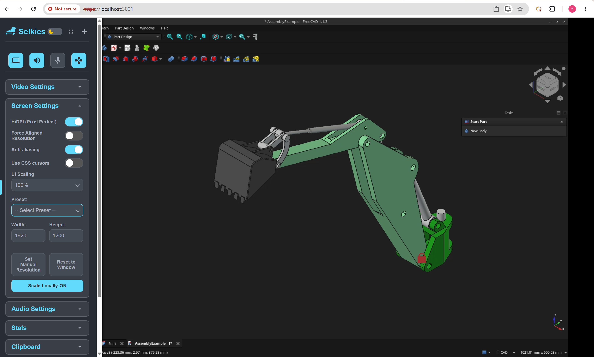

# FreeCAD Web Streaming Server

A guide to deploying a WebRTC-streamed **Native FreeCAD (v1.1.x+)** server using **Rootless Podman** and **systemd Quadlets** on **Ubuntu 24.04 LTS** (CPU rendering by default, with optional GPU acceleration).

---

## 🏗️ Architecture & Features

- **FreeCAD GUI**: Full 64-bit desktop FreeCAD streamed in real-time to any modern web browser via KasmVNC / Selkies (WebRTC / WebSocket), running smoothly on CPU via software rasterization (Mesa llvmpipe).
- **Optional GPU Acceleration**: Supports passthrough for AMD/Intel (`/dev/dri`, `/dev/kfd`) or Nvidia GPUs for hardware-accelerated 3D viewport and Zero-Copy video encoding.
- **Rootless Security**: Runs under user space via Rootless Podman without root privileges.
- **Systemd Quadlet**: Managed as an auto-restarting user systemd service.
- **AI Co-Design (`koi_bridge`)**: An HTTP endpoint opened _inside_ the running GUI FreeCAD process, so an AI agent and the human are driving the same document, in the same interpreter, on the same undo stack. See Step 5.
- **AI / Headless Integration**: Direct CLI access via `freecadcmd` for batch generation. Note that this is a **separate** interpreter — see the warning in Step 5.

---

## 💻 Verified Hardware & Environment

| Component            | Tested Spec                                             |
| :------------------- | :------------------------------------------------------ |
| **OS**               | Ubuntu 24.04 LTS (x86_64 / arm64)                       |
| **CPU**              | 64-bit CPU (AVX2 supported for Wayland mode)            |
| **GPU**              | _None required_ (CPU rendering default; GPU optional)   |
| **Container Engine** | Podman v4.9.3+ (Rootless) or Docker                     |
| **Image**            | `docker.io/linuxserver/freecad:latest` (FreeCAD 1.1.3+) |

> **Pin the image before you rely on the CAD behaviour.** `:latest` plus
> `Restart=always` plus any auto-update means the FreeCAD under your agent can
> change overnight — new OCCT, new toponaming behaviour, a different set of
> workbenches — with no deploy on your side. Resolve the digest once and use it:
>
> ```bash
> podman image inspect docker.io/linuxserver/freecad:latest --format '{{index .RepoDigests 0}}'
> docker.io/linuxserver/freecad@sha256:13907f44a4425a5847a191eebd492e5ed85001044949b012c7ee70ce91c1aa50
> ```
>
> Put that digest in the `ExecStart` below. The freecad-live skill pins the
> build a second time, independently, from inside the process (`pin-commit`,
> `pin-fingerprint`), and will refuse to attach in `strict` mode if the image
> moved under it. Two pins, because the image tag and the binary are two things
> that can drift separately.
>
> | **Ports** | `3000` (HTTP) / `3001` (HTTPS) / `8765` (koi bridge) |

---

## 📁 Step 1: Create Storage Directories

Create persistent directories on the host for CAD configuration, addons, macros, and project workspaces:

```bash
mkdir -p ~/freecad-stream/config
mkdir -p ~/freecad-stream/workspace
# Make the mounts writable by the container's user
podman unshare chown -R 1000:1000 ~/freecad-stream/workspace
podman unshare chown -R 1000:1000 ~/freecad-stream/config

# Where the bridge will write exports (STEP/FCStd handovers). It lives under
# the workspace bind mount on purpose: files the AI writes show up on the host
# immediately, with no download and no copy out of the container.
mkdir -p ~/freecad-stream/workspace/koi_export

# The FreeCAD macro directory, bind-mounted through /config. This is how
# koi_bridge.py gets into the container without rebuilding the image.
mkdir -p ~/freecad-stream/config/.local/share/FreeCAD/v1-1/Macro
```

---

## ⚡ Step 2: Quick Start (Manual Podman Run)

### Standard CPU-Only Command (Default)

To run the container without requiring any GPU:

```bash
podman run -d \
  --name freecad-stream \
  --security-opt seccomp=unconfined \
  --shm-size=2gb \
  -e PUID=1000 \
  -e PGID=1000 \
  -e TZ=Etc/UTC \
  -p 3000:3000 \
  -p 3001:3001 \
  -p 8765:8765 \
  -e KOI_BRIDGE_HOST=0.0.0.0 \
  -e KOI_BRIDGE_PORT=8765 \
  -e KOI_BRIDGE_TOKEN="$KOI_BRIDGE_TOKEN" \
  -e KOI_EXPORT_DIR=/workspace/koi_export \
  -v ~/freecad-stream/config:/config:Z \
  -v ~/freecad-stream/workspace:/workspace:Z \
  --restart unless-stopped \
  docker.io/linuxserver/freecad@sha256:13907f44a4425a5847a191eebd492e5ed85001044949b012c7ee70ce91c1aa50
```

---

### Optional: GPU Hardware Acceleration (AMD GPU Example)

If you have a dedicated GPU (e.g. AMD Radeon), you can enable hardware acceleration for OpenGL 3D viewport rendering and Zero-Copy video stream encoding.

#### Host GPU Permissions (AMD / Intel):

Ensure your host user has access to Direct Rendering Infrastructure (`/dev/dri`) and Kernel Fusion Driver (`/dev/kfd`):

```bash
# Add user to render and video groups
sudo usermod -aG render,video $USER
newgrp render

# Verify device nodes exist
ls -la /dev/dri
ls -la /dev/kfd
```

#### Run with AMD GPU Passthrough:

```bash
podman run -d \
  --name freecad-stream \
  --security-opt seccomp=unconfined \
  --shm-size=2gb \
  -e PUID=1000 \
  -e PGID=1000 \
  -e TZ=Etc/UTC \
  -p 3000:3000 \
  -p 3001:3001 \
  -p 8765:8765 \
  -e KOI_BRIDGE_HOST=0.0.0.0 \
  -e KOI_BRIDGE_PORT=8765 \
  -e KOI_BRIDGE_TOKEN="$KOI_BRIDGE_TOKEN" \
  -e KOI_EXPORT_DIR=/workspace/koi_export \
  -v ~/freecad-stream/config:/config:Z \
  -v ~/freecad-stream/workspace:/workspace:Z \
  --device /dev/dri:/dev/dri \
  --device /dev/kfd:/dev/kfd \
  --group-add keep-groups \
  --restart unless-stopped \
  docker.io/linuxserver/freecad@sha256:13907f44a4425a5847a191eebd492e5ed85001044949b012c7ee70ce91c1aa50
```

> **Why `KOI_BRIDGE_HOST=0.0.0.0` is not a security hole here, and where it
> becomes one.** The bridge executes arbitrary Python as the FreeCAD user, so
> its default is to bind loopback and rely on the machine boundary. Inside a
> container that default is wrong in a way that just breaks things: a process
> bound to the container's `127.0.0.1` is not reachable through `-p` at all.
> The isolation boundary here is the **network namespace**, not loopback — so
> bind `0.0.0.0` _inside_ and control exposure with the publish flag and the
> token. `-p 8765:8765` publishes on every host interface; if you want the
> bridge reachable only through an SSH tunnel (recommended — Step 6), publish
> it on host loopback instead: `-p 127.0.0.1:8765:8765`.

> **Important Note on LinuxServer.io Images:**
> Do **not** pass `--userns=keep-id`. LinuxServer images use internal `s6-overlay` process management which requires default rootless user namespace mapping (`UID 0` mapped to host user) to configure internal permissions properly.

---

## 🔄 Step 3: Production Setup (Systemd User Service / Quadlet)

To ensure FreeCAD automatically starts on system boot as a background service:

### 1. Enable Systemd User Lingering

Allows user services to run even when not actively logged in via SSH:

```bash
loginctl enable-linger $USER
```

### 2. Create the Quadlet Definition File

First put the token somewhere systemd can read it — not in the unit file,
which is world-readable:

```bash
install -m 600 /dev/null ~/freecad-stream/bridge.env
echo "KOI_BRIDGE_TOKEN=$(openssl rand -hex 16)" > ~/freecad-stream/bridge.env
cat ~/freecad-stream/bridge.env
```

This will output something like (you will paste this into SKILL.md in Step 7):

```bash
KOI_BRIDGE_TOKEN=57c5d4c01a424d1fb891d20021987080
```

#### Create the Service File (CPU-Only Default):

```bash
mkdir -p ~/.config/systemd/user/
cat << 'EOF' > ~/.config/systemd/user/freecad.service
[Unit]
Description=FreeCAD KasmVNC WebRTC Streaming Container
After=network-online.target
Wants=network-online.target

[Service]
Type=exec
Restart=always
RestartSec=5s
EnvironmentFile=%h/freecad-stream/bridge.env
ExecStartPre=-/usr/bin/podman stop -t 10 freecad-stream
ExecStartPre=-/usr/bin/podman rm freecad-stream
ExecStart=/usr/bin/podman run \
  --name freecad-stream \
  --security-opt seccomp=unconfined \
  --shm-size=2gb \
  -e PUID=1000 \
  -e PGID=1000 \
  -e TZ=Etc/UTC \
  -p 3000:3000 \
  -p 3001:3001 \
  -p 8765:8765 \
  -e KOI_BRIDGE_HOST=0.0.0.0 \
  -e KOI_BRIDGE_PORT=8765 \
  -e KOI_BRIDGE_TOKEN=${KOI_BRIDGE_TOKEN} \
  -e KOI_EXPORT_DIR=/workspace/koi_export \
  -v %h/freecad-stream/config:/config:Z \
  -v %h/freecad-stream/workspace:/workspace:Z \
  docker.io/linuxserver/freecad@sha256:13907f44a4425a5847a191eebd492e5ed85001044949b012c7ee70ce91c1aa50

ExecStop=/usr/bin/podman stop -t 10 freecad-stream

[Install]
WantedBy=default.target
EOF
```

_(Optional: To use GPU acceleration in systemd, simply add `--device /dev/dri:/dev/dri --device /dev/kfd:/dev/kfd --group-add keep-groups` to `ExecStart` above)._

### 3. Reload and Start the Service

```bash
systemctl --user daemon-reload
systemctl --user start freecad.service
systemctl --user status freecad.service
```

---

## 🌐 Step 4: Accessing the Stream from a Remote Client

### In your browser:

Open:

- **HTTPS (Recommended):** `https://$SERVER_IP:3001` _(Accept self-signed cert)_

### Fixing UI Blurriness & Adjusting Resolution

By default, WebRTC streaming may apply automatic UI scaling that can cause text and icons to appear blurry. To get a crisp 1:1 display:

1. Open the **Selkies sidebar** (click the pull handle at the top-left edge of the screen).
2. Expand the **Screen Settings** section.
3. Set **UI Scaling** to **`100%`** (disables artificial scaling for maximum sharpness).
4. Under **Preset**, select a resolution that matches your display (e.g., `1920 x 1200` or `1920 x 1080`), or click **Reset to Window** to automatically fit your current browser viewport.

<div align="center">
  
  <br>
</div>

---

## 🤖 Step 5: AI Automation

### The bridge

`skills/freecad-live/tools/koi_bridge.py` opens an HTTP endpoint **inside the
GUI process** and marshals incoming Python onto the Qt thread that owns the
document. One interpreter, one document, one undo stack — the agent writes, the
human sees it happen and can take the mouse mid-session.

#### 5.1 Copy the bridge into the macro directory

Creates the FreeCAD Macro folder on the FreeCAD server machine:

```bash
podman unshare chmod -R u+rwX,g+rwX,o+rwX ~/freecad-stream/config/.local/share/FreeCAD
mkdir -p ~/freecad-stream/config/.local/share/FreeCAD/v1-1/Macro
```

Copy the koi_bridge.py from the koi freecad-live skill to the FreeCAD server's Macro folder:

```bash
rsync -av skills/freecad-live/tools/koi_bridge.py   $USER@192.168.68.113:~/freecad-stream/config/.local/share/FreeCAD/v1-1/Macro/
```

#### 5.2 Start the bridge manually (do this first for testing)

Create this wrapper macro on the FreeCAD server:

```bash
cat << 'EOF' >  ~/freecad-stream/config/.local/share/FreeCAD/v1-1/Macro/koi_start.FCMacro
import os
os.environ.setdefault("KOI_BRIDGE_HOST", "0.0.0.0")
os.environ.setdefault("KOI_BRIDGE_TOKEN", "PASTE-THE-TOKEN-HERE")
os.environ.setdefault("KOI_EXPORT_DIR", "/workspace/koi_export")
exec(open("/config/.local/share/FreeCAD/v1-1/Macro/koi_bridge.py").read())
EOF
```

In the streamed FreeCAD WebRTC GUI, run the macro with: **Macro → Macros… → `koi_start` → Execute**.

Then verify the bridge working from FreeCAD server locally:

```bash
curl -s -H "X-Koi-Token: $KOI_BRIDGE_TOKEN" http://127.0.0.1:8765/hello | jq

# Sample output
{
  "ok": true,
  "protocol": 1,
  "pid": 367,
  "gui": true,
  "mode": "gui",
  "dispatch": "qtimer/15ms",
  "started": "2026-08-18T04:50:54Z",
  "exportDir": "/workspace/koi_export",
  "tokenRequired": true,
  "running": null,
  "app": {
    "version": "1.1.3",
    "commit": "145529fe741292ff0b3977a01195bf0247425794",
    "branch": "grafted,grafted",
    "buildDate": "2026/07/25 04:52:02",
    "occt": "7.8.1",
    "python": "3.11.14",
    "exe": "/opt/freecad/usr/bin/freecad",
    "resourceDir": "/opt/freecad/usr/"
  },
  "fingerprint": "exe:159624@1784962801",
  "exeBytes": 159624,
  "exeModified": "2026-07-25T07:00:01Z"
}
```

#### 5.3 Start it automatically (once 5.2 works)

Create this InitGui.py on FreeCAD server:

```bash
MODDIR=~/freecad-stream/config/.local/share/FreeCAD/v1-1/Mod/koi_bridge
mkdir -p "$MODDIR"

cat << 'EOF' > "$MODDIR/InitGui.py"
import os

os.environ.setdefault("KOI_BRIDGE_HOST", "0.0.0.0")
os.environ.setdefault("KOI_EXPORT_DIR", "/workspace/koi_export")
# If container environment variables are not forwarded to FreeCAD GUI, uncomment and paste token:
# os.environ.setdefault("KOI_BRIDGE_TOKEN", "PASTE-THE-TOKEN-HERE")

def _start_koi_bridge():
    import os
    import FreeCAD

    # Check v1-1 macro directory first, then fallback
    macro_path = "/config/.local/share/FreeCAD/v1-1/Macro/koi_bridge.py"
    if not os.path.exists(macro_path):
        macro_path = "/config/.local/share/FreeCAD/Macro/koi_bridge.py"

    try:
        with open(macro_path, "r") as f:
            code = compile(f.read(), macro_path, "exec")
            exec(code, {"__name__": "__koi_bridge__", "__file__": macro_path})
    except Exception as e:
        FreeCAD.Console.PrintError("koi_bridge autostart failed: %s\n" % e)

try:
    from PySide import QtCore
except ImportError:
    from PySide6 import QtCore

QtCore.QTimer.singleShot(4000, _start_koi_bridge)
EOF

chmod -R u+rwX,g+rX,o+rX "$MODDIR"

systemctl --user restart freecad.service
```

Watch the streamed FreeCAD WebRTC GUI, after 4 seconds, you should see:

```
koi_bridge: listening on http://0.0.0.0:8765 (protocol 1, gui, dispatch qtimer/15ms)
koi_bridge: FreeCAD 1.1.x ..., exports to /workspace/koi_export
```

---

## 🔐 Step 6: Reaching the bridge from your workstation

### SSH tunnel from workstation to FreeCAD server

```bash
ssh -N -L 8765:127.0.0.1:8765 $USER@192.168.68.113
```

### Verify from workstation before touching the skill

```bash
# From your workstation, with the tunnel up (A) or against the LAN IP (B):
KOI_BRIDGE_TOKEN=57c5d4c01a424d1fb891d20021987080 curl -s -H "X-Koi-Token: $KOI_BRIDGE_TOKEN" http://127.0.0.1:8765/hello | jq
```

You should be able to see same result as above FreeCAD server local test.

---

## 🔗 Step 7: Point the freecad-live skill at it

In `skills/freecad-live/SKILL.md`:

```yaml
mcp-servers:
  - name: freecad_bridge
    script: mcp/freecad_mcp.js
    bridge-url: http://127.0.0.1:8765
    bridge-token: "57c5d4c01a424d1fb891d20021987080"
    stream-url: https://192.168.68.113:3001
    pin-version: "1.1.3"
    pin-commit: "145529fe741292ff0b3977a01195bf0247425794"
    pin-fingerprint: "exe:159624@1784962801"
    pin-mode: strict
```

---

## 🛠️ Management & Diagnostics

| Task                            | Command                                                                                                         |
| :------------------------------ | :-------------------------------------------------------------------------------------------------------------- |
| **Check Logs**                  | `podman logs -f freecad-stream`                                                                                 |
| **Restart Service**             | `systemctl --user restart freecad.service`                                                                      |
| **Stop Service**                | `systemctl --user stop freecad.service`                                                                         |
| **Container Shell**             | `podman exec -it freecad-stream bash`                                                                           |
| **Verify Renderer (CPU / GPU)** | `podman exec -it freecad-stream bash -c "glxinfo -B 2>/dev/null \| grep -E 'Device\|Vendor\|OpenGL\|renderer'"` |
| **Bridge alive?**               | `curl -s -H "X-Koi-Token: $KOI_BRIDGE_TOKEN" http://127.0.0.1:8765/hello`                                       |
| **What is the bridge doing?**   | same call — the `running` field names the job on the GUI thread and how long it has held it                     |
| **Bridge port from inside**     | `podman exec -it freecad-stream bash -c "ss -ltnp \| grep 8765"`                                                |
| **Exports the agent wrote**     | `ls -la ~/freecad-stream/workspace/koi_export`                                                                  |
| **Can the agent write them?**   | `curl -s -H "X-Koi-Token: $KOI_BRIDGE_TOKEN" http://127.0.0.1:8765/hello \| jq '.exportWritable, .exportError'` |
| **Fix mount ownership**         | `podman unshare chown -R 1000:1000 ~/freecad-stream/workspace`                                                  |

---

## 📚 References & Original Documentation

- [LinuxServer.io FreeCAD Image Documentation](https://docs.linuxserver.io/images/docker-freecad/)
- [LinuxServer.io Hardware Acceleration & Wayland Guide](https://docs.linuxserver.io/images/docker-freecad/#hardware-acceleration-wayland)
- [LinuxServer.io Selkies GPU Acceleration Guide (Intel, AMD & Nvidia)](https://docs.linuxserver.io/selkies/user-guide/gpu/)
- [LinuxServer.io Selkies Open-Source Drivers Guide (Intel & AMD DRI)](https://docs.linuxserver.io/selkies/user-guide/gpu/#intel-and-amd-open-source-drivers)
- [LinuxServer.io Baseimage Selkies Repository](https://github.com/linuxserver/docker-baseimage-selkies)
- [KasmVNC WebRTC Streaming Project](https://kasmweb.com/docs/latest/index.html)
- [Podman Quadlet Systemd Documentation](https://docs.podman.io/en/latest/markdown/podman-systemd.unit.5.html)
