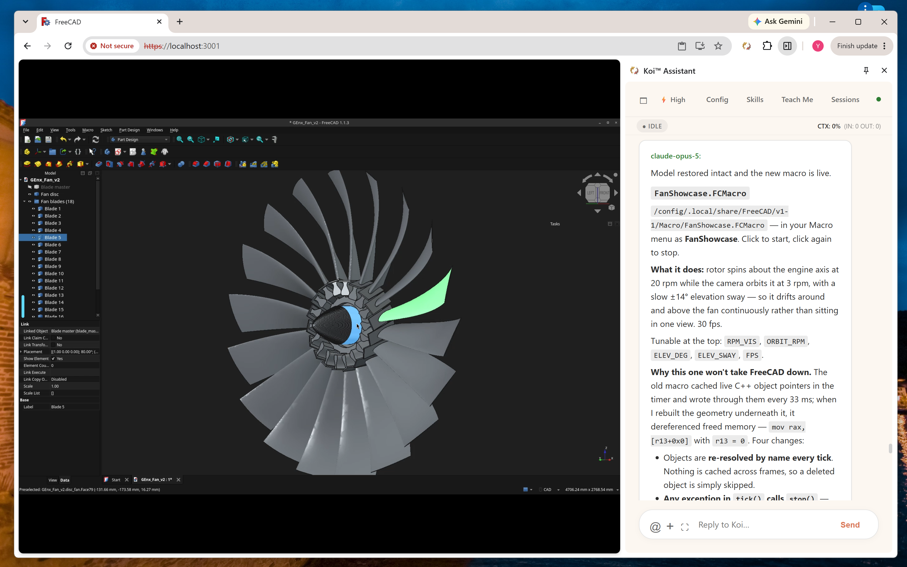
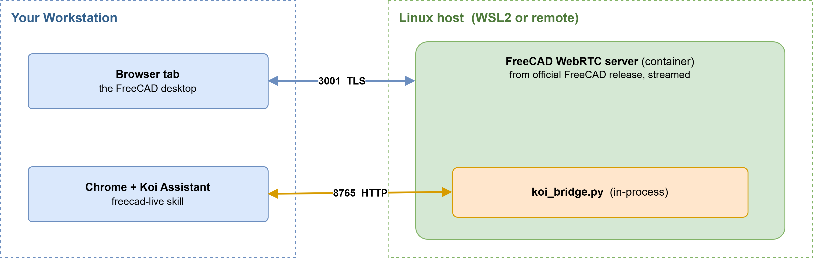
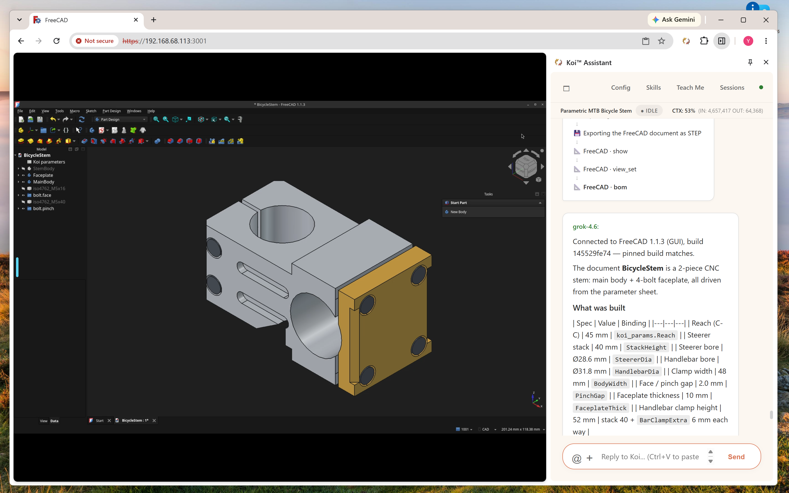
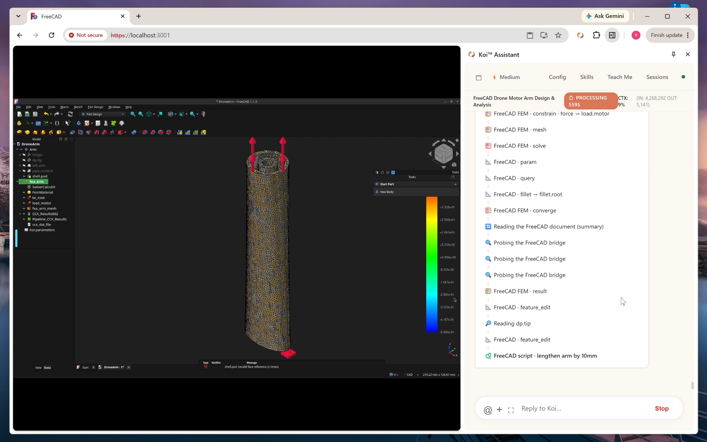

# FreeCAD Live Skill For Koi™ Assistant

Human/AI co-design on a live FreeCAD document, built on the official FreeCAD release and exposing native CAD, CAE (FEM), and CAM capabilities directly to the AI agent.

Instead of running scripts blindly against a headless kernel, this skill connects the AI directly to your **live, browser-streamed FreeCAD session**:

- **One process, one document, one undo stack.** The bridge runs directly inside FreeCAD's GUI process. The AI edits through FreeCAD's Python interface while you interact through the 3D GUI on the exact same document.
- **Take the mouse at any moment.** Orbit, tweak a sketch, or delete an AI-generated feature. The agent syncs changes every turn and respects your manual edits rather than rebuilding over them.
- **Shared visual canvas** Use the [visual workspace](./docs/visual-interaction.png) feature of Koi™ Assistant, freely select any content from FreeCAD GUI to interact with AI.
- **Shared assistant context.** As a native Koi™ Assistant skill, the AI can query your design specifications, component catalogs, documents, or databases alongside the active CAD workflow.

A wrong turn costs one turn: if a feature isn't what you intended, adjust it immediately in place rather than starting a script from scratch.

[](https://youtu.be/x_JI_yhrWeM)

---

## 1. Architecture

Three pieces, each with one job.

<div align="center">
  
  <br>
</div>

**FreeCAD WebRTC server.** A container running a full desktop FreeCAD
(`linuxserver/freecad`) whose window is streamed to a browser over WebRTC
(Selkies/KasmVNC). This is where FreeCAD actually runs and where _you_ click.
CPU rendering by default (Mesa llvmpipe); GPU optional. Ports **3000**
(plaintext) and **3001** (TLS).

**The koi bridge (`koi_bridge.py`).** A small HTTP endpoint opened _inside that
same GUI process_ by a FreeCAD macro. It accepts requests on port **8765** and
marshals the work onto the Qt thread that owns the document. That in-process
detail is the whole point: the agent is not running a second headless FreeCAD
with its own document — it edits the document you are looking at, and you see
each change land and can take the mouse mid-session. It also writes exports to
a directory bind-mounted onto the host.

**The freecad-live skill.** The Koi side. It speaks to the bridge, reads the
document every turn, edits through a validated call whitelist inside a
transaction envelope, measures results instead of trusting them, checks that
the result can be manufactured before it leaves the session, and pins the exact
FreeCAD build it is talking to.

**Ports.** All three published on host loopback only. The scheme follows the
port: `https://` works on 3001 and nowhere else; the bridge on 8765 is plain
HTTP by design.

| Port | What                      | Scheme         |
| :--- | :------------------------ | :------------- |
| 3000 | stream, plaintext         | `http://`      |
| 3001 | stream, TLS (self-signed) | `https://`     |
| 8765 | koi bridge                | `http://` only |

**Verified on:** Windows 11 + WSL2 Ubuntu 22.04 (server on the same machine as
Chrome) **and** a standalone Ubuntu 24.04 server reached over SSH. Both work;
the only difference is Step 5.

---

# Part I — Setup

Everything below runs **on the Linux host** unless a step says otherwise.
Requirements: a 64-bit CPU, Podman 4.9.3+ rootless (or Docker). No GPU needed.

### Prerequisites

- Podman 4.9.3+ rootless (or Docker)
- Configured subuids/subgids for rootless namespace:

```bash
# Check if subuids/subgids exist for your user:
grep $USER /etc/subuid /etc/subgid

# If missing, add them and migrate (requires sudo):
sudo usermod --add-subuids 100000-165535 --add-subgids 100000-165535 $USER
podman system migrate
```

## Step 1: Directories and credentials

```bash
mkdir -p ~/freecad-stream/config
mkdir -p ~/freecad-stream/workspace
# Make the mounts writable by the container's user
podman unshare chown -R 1000:1000 ~/freecad-stream/workspace
podman unshare chown -R 1000:1000 ~/freecad-stream/config

# Where the bridge writes exports (STEP/FCStd handovers). It lives under the
# workspace bind mount on purpose: files the AI writes appear on the host
# immediately, with no download and no copy out of the container.
podman unshare mkdir -p ~/freecad-stream/workspace/koi_export

# The FreeCAD macro directory, bind-mounted through /config. This is how
# koi_bridge.py gets into the container without rebuilding the image.
podman unshare mkdir -p ~/freecad-stream/config/.local/share/FreeCAD/v1-1/Macro
```

### Your two credentials

**These are generated per install. There is no default and nothing to look up —
you create them now and read them back later.**

| Credential                 | Guards                            | Used at                        |
| :------------------------- | :-------------------------------- | :----------------------------- |
| `CUSTOM_USER` / `PASSWORD` | the streamed desktop on 3000/3001 | browser login, Step 4          |
| `KOI_BRIDGE_TOKEN`         | the bridge on 8765                | the skill's Run dialog, Step 7 |

Generate both into one file that only you can read:

```bash
install -m 600 /dev/null ~/freecad-stream/bridge.env
{
  echo "KOI_BRIDGE_TOKEN=$(openssl rand -hex 32)"
  echo "CUSTOM_USER=koi"
  echo "PASSWORD=$(openssl rand -hex 24)"
} > ~/freecad-stream/bridge.env
```

Read them back whenever you need them:

```bash
grep -E 'CUSTOM_USER|PASSWORD' ~/freecad-stream/bridge.env   # browser login
grep KOI_BRIDGE_TOKEN ~/freecad-stream/bridge.env            # skill token
```

Every `podman run` below reads this file with `--env-file`. Do **not** pass
these with `-e NAME=value`: that puts the secret in the container's argv, where
any local account reads it out of `ps aux` and `podman inspect`.

## Step 2: Start the server

```bash
podman run -d \
  --name freecad-stream \
  --security-opt seccomp=unconfined \
  --shm-size=2gb \
  -e PUID=1000 \
  -e PGID=1000 \
  -e TZ=Etc/UTC \
  -p 127.0.0.1:3000:3000 \
  -p 127.0.0.1:3001:3001 \
  -p 127.0.0.1:8765:8765 \
  --env-file ~/freecad-stream/bridge.env \
  -e HARDEN_DESKTOP=true \
  -e DISABLE_SUDO=true \
  -e KOI_BRIDGE_HOST=0.0.0.0 \
  -e KOI_BRIDGE_PORT=8765 \
  -e KOI_EXPORT_DIR=/workspace/koi_export \
  -v ~/freecad-stream/config:/config:Z \
  -v ~/freecad-stream/workspace:/workspace:Z \
  --restart unless-stopped \
  docker.io/linuxserver/freecad@sha256:13907f44a4425a5847a191eebd492e5ed85001044949b012c7ee70ce91c1aa50
```

Two flags that look wrong and are not:

- **`KOI_BRIDGE_HOST=0.0.0.0`** binds the bridge to all interfaces _inside the
  container_. The isolation boundary here is the network namespace, not
  loopback — a process bound to the container's `127.0.0.1` is not reachable
  through `-p` at all. Exposure is controlled by the publish flag, which is
  `127.0.0.1:8765:8765`, host loopback only.
- **No `--userns=keep-id`.** LinuxServer images use `s6-overlay`, which needs
  the default rootless mapping (UID 0 → host user) to set internal permissions.

**Verify:** `podman logs -f freecad-stream` should settle without errors, then
continue to Step 4 (if the server is on this machine) or Step 5 first (if it is
remote).

## Step 3: Open the stream and verify FreeCAD

Get the login, then open the page:

```bash
grep -E 'CUSTOM_USER|PASSWORD' ~/freecad-stream/bridge.env
```

```bash
CUSTOM_USER=koi
PASSWORD=ca83a64e1feee09622b2858966289d4edc57c5e5c4c81b2c
```

Browse to **`https://localhost:3001`** and log in with those. (Remote host: set
up the tunnel in Step 5 first — the URL stays `localhost:3001`.)

The certificate is self-signed, so the browser warns. Over a loopback tunnel
that is expected and the traffic is already inside SSH. Do not make a habit of
clicking through it against a remote address — that is the case where the
warning means something.

**Working means:** you see the FreeCAD desktop and can click menus in it.

### Fix blurry text

WebRTC applies automatic UI scaling by default. For a crisp 1:1 display:

1. Open the **Selkies sidebar** (pull handle, top-left edge of the screen).
2. Expand **Screen Settings**.
3. Set **UI Scaling** to **100%**.
4. Under **Preset**, pick a resolution matching your display (e.g.
   `1920 x 1200`), or **Reset to Window** to fit the browser viewport.

<div align="center">
  
  <br>
</div>

## Step 4: Install and start the bridge

### 4.1 Copy `koi_bridge.py` into FreeCAD's macro directory

```bash
podman unshare mkdir -p ~/freecad-stream/config/.local/share/FreeCAD/v1-1/Macro
```

Copy it out of the skill:

```bash
# Local host (from repo root):
podman unshare cp skills/freecad-live/tools/koi_bridge.py ~/freecad-stream/config/.local/share/FreeCAD/v1-1/Macro/

# Remote host:
rsync -av skills/freecad-live/tools/koi_bridge.py \
  $USER@192.168.68.113:~/freecad-stream/config/.local/share/FreeCAD/v1-1/Macro/
```

### 4.2 Start it manually first

Create a wrapper macro on the server:

```bash
cat << 'EOF' | podman unshare tee ~/freecad-stream/config/.local/share/FreeCAD/v1-1/Macro/koi_start.FCMacro > /dev/null
import os
os.environ.setdefault("KOI_BRIDGE_HOST", "0.0.0.0")
os.environ.setdefault("KOI_EXPORT_DIR", "/workspace/koi_export")
# No token line: --env-file already put KOI_BRIDGE_TOKEN in this process's
# environment, and setdefault leaves it alone. Hardcoding it here would write
# the secret into /config, which is world-readable and lives in your home
# directory. If your setup really does not forward the environment, paste it
# in and then `chmod 600` this file — and know that it is now a secret at rest
# on a bind mount.
exec(open("/config/.local/share/FreeCAD/v1-1/Macro/koi_bridge.py").read())
EOF
```

In the streamed FreeCAD GUI: **Macro → Macros… → `koi_start` → Execute**.

> **Tip for debugging in FreeCAD**:
> If nothing happens or the curl test fails, enable the output panels in FreeCAD to see macro errors:
> **View** -> **Panels** -> check **Report view** and **Python console**.

**Verify from the server:**

```bash
set -a; . ~/freecad-stream/bridge.env; set +a   # keeps the token out of argv
curl -s -H "X-Koi-Token: $KOI_BRIDGE_TOKEN" http://127.0.0.1:8765/hello | jq
```

```json
{
  "ok": true,
  "protocol": 1,
  "pid": 367,
  "gui": true,
  "mode": "gui",
  "dispatch": "qtimer/15ms",
  "started": "2026-08-18T04:50:54Z",
  "exportDir": "/workspace/koi_export",
  "tokenRequired": true,
  "running": null,
  "app": {
    "version": "1.1.3",
    "commit": "145529fe741292ff0b3977a01195bf0247425794",
    "branch": "grafted,grafted",
    "buildDate": "2026/07/25 04:52:02",
    "occt": "7.8.1",
    "python": "3.11.14",
    "exe": "/opt/freecad/usr/bin/freecad",
    "resourceDir": "/opt/freecad/usr/"
  },
  "fingerprint": "exe:159624@1784962801",
  "exeBytes": 159624,
  "exeModified": "2026-07-25T07:00:01Z"
}
```

`"gui": true` is the field that matters: the bridge is inside the process you
are watching, not a headless second one.

### 4.3 Start it automatically (once 5.2 works)

```bash
MODDIR=~/freecad-stream/config/.local/share/FreeCAD/v1-1/Mod/koi_bridge
podman unshare mkdir -p "$MODDIR"

cat << 'EOF' | podman unshare tee "$MODDIR/InitGui.py" > /dev/null
import os

os.environ.setdefault("KOI_BRIDGE_HOST", "0.0.0.0")
os.environ.setdefault("KOI_EXPORT_DIR", "/workspace/koi_export")
# The token comes from --env-file. Pasting it here writes a secret into a
# world-readable file on a bind mount; if you have no alternative, chmod 600
# this file afterwards.

def _start_koi_bridge():
    import os
    import FreeCAD

    # Check v1-1 macro directory first, then fallback
    macro_path = "/config/.local/share/FreeCAD/v1-1/Macro/koi_bridge.py"
    if not os.path.exists(macro_path):
        macro_path = "/config/.local/share/FreeCAD/Macro/koi_bridge.py"

    try:
        with open(macro_path, "r") as f:
            code = compile(f.read(), macro_path, "exec")
            exec(code, {"__name__": "__koi_bridge__", "__file__": macro_path})
    except Exception as e:
        FreeCAD.Console.PrintError("koi_bridge autostart failed: %s\n" % e)

try:
    from PySide import QtCore
except ImportError:
    from PySide6 import QtCore

QtCore.QTimer.singleShot(4000, _start_koi_bridge)
EOF

# Ensure correct ownership and permissions for container user 1000
podman unshare chown -R 1000:1000 ~/freecad-stream/config ~/freecad-stream/workspace
podman unshare chmod -R u+rwX,go+rX ~/freecad-stream/config
```

Restart the container (or the systemd service from Step 8). Watch the streamed
GUI; after ~4 seconds:

```
koi_bridge: listening on http://0.0.0.0:8765 (protocol 1, gui, dispatch qtimer/15ms)
koi_bridge: FreeCAD 1.1.x ..., exports to /workspace/koi_export
```

## Step 5: Reach the server from your workstation

**Skip this entirely if the server runs on the same machine as Chrome** — e.g.
Windows 11 workstation with the server in WSL2. Loopback already reaches it.

Otherwise, nothing is published off the FreeCAD host, so both the stream and
the bridge come to you through one tunnel:

```bash
ssh -N -L 3001:127.0.0.1:3001 -L 8765:127.0.0.1:8765 $USER@192.168.68.113
```

The stream is then `https://localhost:3001` and the bridge is
`http://localhost:8765`. The bridge speaks plain HTTP: over the tunnel that is
fine, because the bytes never touch the wire unencrypted. Pointed straight at
`http://192.168.68.113:8765` it is not fine — the token and every document
cross the network in the clear, and the skill will say so on attach.

**Verify from the workstation before touching the skill:**

```bash
# Read the token from a file rather than typing it: a token on the command
# line is a token in ~/.bash_history.
KOI_BRIDGE_TOKEN=$(ssh $USER@192.168.68.113 'grep -h KOI_BRIDGE_TOKEN ~/freecad-stream/bridge.env | cut -d= -f2')
curl -s -H "X-Koi-Token: $KOI_BRIDGE_TOKEN" http://127.0.0.1:8765/hello | jq
```

You should see the same JSON as in 5.2.

## Step 6: Point the skill at it

Open **Skills → freecad-live → Run**, fill in three fields, press **Run Skill**.

| Field         | Value                    | Notes                                                                                                                           |
| :------------ | :----------------------- | :------------------------------------------------------------------------------------------------------------------------------ |
| `bridgeUrl`   | `http://localhost:8765`  | Plain HTTP. `https://` fails at the TLS handshake before it can authenticate. Safe here: loopback, or inside the Step 5 tunnel. |
| `bridgeToken` | from `bridge.env`        | `grep KOI_BRIDGE_TOKEN ~/freecad-stream/bridge.env` on the FreeCAD host.                                                        |
| `streamUrl`   | `https://localhost:3001` | Optional. 3001 is TLS, 3000 is plaintext. Nothing in the skill fetches this; it is the link you open to watch.                  |

Use the Run dialog rather than pasting the token into the chat: it goes from
the form to the bridge client without entering the transcript. The binding
lasts for the session; a new session needs the dialog again.

**Verify:** Run test script `/skill freecad-live/scripts/test_connect.js --full-auto` from Koi user message box, a successful attach reports `Script finished. Success: true `.
If not, review the Koi extension's console log:

| Symptom                                    | Cause                                                                   |
| :----------------------------------------- | :---------------------------------------------------------------------- |
| `401 Unauthorized` on `/exec`              | Token missing or stale. This is the guard working — the bridge is up.   |
| Connection refused / TLS error on 8765     | `https://` in `bridgeUrl`, or the tunnel is down.                       |
| `No FreeCAD bridge is answering`           | The macro was never run — Step 5.2, or check the autostart in 5.3.      |
| Warning that the transport is in the clear | `bridgeUrl` points at a remote host over `http://`. Tunnel it (Step 5). |

At this point you have a working environment. Everything below is optional or
explanatory.

## Step 7: Run it as a service (optional but recommended)

So FreeCAD comes back on boot and after a crash.

```bash
loginctl enable-linger $USER      # user services run without an SSH session
```

```bash
mkdir -p ~/.config/systemd/user/
cat << 'EOF' > ~/.config/systemd/user/freecad.service
[Unit]
Description=FreeCAD KasmVNC WebRTC Streaming Container
After=network-online.target
Wants=network-online.target

[Service]
Type=exec
Restart=always
RestartSec=5s
ExecStartPre=-/usr/bin/podman stop -t 10 freecad-stream
ExecStartPre=-/usr/bin/podman rm freecad-stream
ExecStart=/usr/bin/podman run \
  --name freecad-stream \
  --security-opt seccomp=unconfined \
  --shm-size=2gb \
  -e PUID=1000 \
  -e PGID=1000 \
  -e TZ=Etc/UTC \
  -p 127.0.0.1:3000:3000 \
  -p 127.0.0.1:3001:3001 \
  -p 127.0.0.1:8765:8765 \
  --env-file %h/freecad-stream/bridge.env \
  -e HARDEN_DESKTOP=true \
  -e DISABLE_SUDO=true \
  -e KOI_BRIDGE_HOST=0.0.0.0 \
  -e KOI_BRIDGE_PORT=8765 \
  -e KOI_EXPORT_DIR=/workspace/koi_export \
  -v %h/freecad-stream/config:/config:Z \
  -v %h/freecad-stream/workspace:/workspace:Z \
  docker.io/linuxserver/freecad@sha256:13907f44a4425a5847a191eebd492e5ed85001044949b012c7ee70ce91c1aa50

ExecStop=/usr/bin/podman stop -t 10 freecad-stream

[Install]
WantedBy=default.target
EOF

systemctl --user daemon-reload
systemctl --user start freecad.service
systemctl --user status freecad.service
```

There is deliberately no `EnvironmentFile=` line: podman reads the file itself
with `--env-file`, so only the _path_ lands in the unit and in the process
table. `EnvironmentFile=` plus `-e KOI_BRIDGE_TOKEN=${KOI_BRIDGE_TOKEN}` would
expand the secret into `ExecStart`, where `ps aux` shows it to every local
account.

---

# Part II — Reference

## Security

What each boundary does, and what it does not.

| Boundary                      | Protects against                                | Does **not** protect against                                                |
| :---------------------------- | :---------------------------------------------- | :-------------------------------------------------------------------------- |
| Loopback publish + SSH tunnel | Everyone not on this host or holding an SSH key | Anything already running on the host                                        |
| `KOI_BRIDGE_TOKEN`            | A local process guessing its way into 8765      | Whoever reaches the stream on 3000/3001                                     |
| `CUSTOM_USER` / `PASSWORD`    | Casual access to the desktop                    | A determined attacker; it is HTTP basic auth                                |
| Rootless podman + userns      | Container root becoming host root               | Anything reaching `/config` and `/workspace`, which are your home directory |
| Digest pin + `pin-mode`       | The build changing under the agent              | A compromised image at that digest                                          |

**Why the desktop needs its own password.** The bridge token guards 8765. It
does not guard 3000/3001, and what is behind those is FreeCAD with a Python
console and a macro editor in it. Anyone who reaches the stream executes code
as the container user without ever seeing the token. LinuxServer ships HTTP
basic auth for exactly this, off by default, and upstream's own description is
that it keeps the kids out rather than the internet — so it is the second lock.
**The first is that nothing here publishes on an interface other than
loopback.**

The bridge runs arbitrary Python as the FreeCAD user by design, so assume
anything with bridge access has the mounts. Two consequences worth designing
around:

- **`/config` is executed, not just read.** `Macro/` and `Mod/*/InitGui.py` run
  on every FreeCAD start. Anything that can write there survives restarts,
  container recreation and token rotation. The skill confines its own
  caller-supplied write paths to `KOI_EXPORT_DIR` for this reason; if you mount
  `/config` read-only after setup, the autostart still works and that class of
  persistence goes away.
- **The agent's input is not trusted input.** Object labels, imported STEP
  metadata and any web page the agent read can carry instructions, and the
  bridge is an interpreter. Guardrails are steering, not containment — they
  fail open and they do not see calls made from inside a running script. The
  network boundary is the control.

### `parameters:` is not `mcp-servers:`

`SKILL.md` has a `parameters:` section listing `bridgeUrl` and `streamUrl`.
Those are **prompt** parameters — the runnable dispatcher seeds them into the
conversation as a user message — and the bridge client never reads them.
Filling them in does not change where the skill connects, and a token put there
would be pasted into the chat and still get a 401. Bridge configuration lives
in `mcp-servers:` (or comes from the Run dialog); nowhere else.

## Build pinning

Two independent pins, because the image tag and the binary drift separately:

1. **The image digest** (Step 2) — fixes what the container starts.
2. **`pin-commit` / `pin-version` in `SKILL.md`** — read from inside the running
   process by the skill. In `pin-mode: strict` it refuses to attach to a build
   that is not the pinned one.

Run the skill once and paste back the `pinBlock` that `freecad_version()`
returns. Note that `pin-fingerprint` (`exe:<size>@<mtime>`) is worth setting
only on a build with no revision hash: on this image the bridge resolves a
launcher shim rather than the real ELF, so a fingerprint pin reports drift on
every attach for a binary that never changed — which is how a gate stops being
read.

## Maintenance and diagnostics

| Task                            | Command                                                                                                         |
| :------------------------------ | :-------------------------------------------------------------------------------------------------------------- |
| **Check logs**                  | `podman logs -f freecad-stream`                                                                                 |
| **Restart service**             | `systemctl --user restart freecad.service`                                                                      |
| **Stop service**                | `systemctl --user stop freecad.service`                                                                         |
| **Container shell**             | `podman exec -it freecad-stream bash`                                                                           |
| **Verify renderer (CPU / GPU)** | `podman exec -it freecad-stream bash -c "glxinfo -B 2>/dev/null \| grep -E 'Device\|Vendor\|OpenGL\|renderer'"` |
| **Bridge alive?**               | `curl -s -H "X-Koi-Token: $KOI_BRIDGE_TOKEN" http://127.0.0.1:8765/hello` (header only — never `?token=`)       |
| **What is the bridge doing?**   | same call — the `running` field names the job on the GUI thread and how long it has held it                     |
| **Bridge port from inside**     | `podman exec -it freecad-stream bash -c "ss -ltnp \| grep 8765"`                                                |
| **Exports the agent wrote**     | `ls -la ~/freecad-stream/workspace/koi_export`                                                                  |
| **Can the agent write them?**   | `curl -s -H "X-Koi-Token: $KOI_BRIDGE_TOKEN" http://127.0.0.1:8765/hello \| jq '.exportWritable, .exportError'` |
| **Fix mount ownership**         | `podman unshare chown -R 1000:1000 ~/freecad-stream/workspace`                                                  |
| **Read the bridge token**       | `grep KOI_BRIDGE_TOKEN ~/freecad-stream/bridge.env`                                                             |
| **Read stream credentials**     | `grep -E 'CUSTOM_USER\|PASSWORD' ~/freecad-stream/bridge.env`                                                   |
| **Rotate the token**            | rewrite the line in `bridge.env`, `systemctl --user restart freecad.service`, update the skill                  |

**Upgrading the image:** resolve a new digest (Step 2), update `ExecStart`,
restart — then re-run the skill's probe suites and re-pin, because every claim
the skill makes about toponaming, threads or workbench availability is a claim
about one build.

**Upgrading the bridge:** `koi_bridge.py` and `mcp/freecad_mcp.js` ship
together. A protocol-mismatch error on attach means version skew — copy the
macro out of the current skill and reload it.

## Optional: GPU acceleration

Only if you have a dedicated GPU and want hardware OpenGL plus zero-copy video
encoding. Both device nodes are kernel attack surface reachable by anything in
the container, which here includes agent-supplied Python — take them only if
you need the acceleration.

### Host permissions (AMD / Intel)

```bash
sudo usermod -aG render,video $USER
newgrp render

ls -la /dev/dri
ls -la /dev/kfd
```

### Run with passthrough

Add to the `podman run` from Step 3 (or to `ExecStart` in Step 8):

```
  --device /dev/dri:/dev/dri \
  --device /dev/kfd:/dev/kfd \
  --group-add keep-groups \
```

## Optional: gmsh and CalculiX for FEM

`freecad_fem` needs two **separate programs**. They are not part of FreeCAD's
Python, and an image that carries the FEM workbench menu very often carries
neither — which is why the skill probes for them and reports what it found
under `binaries` rather than assuming. Everything else in the skill works
without them.

```bash
# Get into the FreeCAD container shell from the server:
podman exec -it freecad-stream bash
# 1. Add bookworm repository with non-free
echo "deb http://deb.debian.org/debian bookworm main contrib non-free" > /etc/apt/sources.list.d/bookworm.list

# 2. Update and install both packages
apt-get update
apt-get install -y gmsh calculix-ccx

# 3. (Optional) Remove the bookworm list to prevent future package mix-ups
rm /etc/apt/sources.list.d/bookworm.list
apt-get update
```

Verify that both binaries are present:

```bash
which gmsh && which ccx
```

To make this permanent, you need to rebuild the container image (omitted for brevity)

FreeCAD finds them on `PATH`. If yours are somewhere else, set the paths in
Edit → Preferences → FEM → Gmsh / CalculiX; the skill reads those preferences
first and falls back to `PATH`.

Two things worth knowing before the first solve. CalculiX is **single
threaded** and runs on the thread that owns the document, so the FreeCAD window
in your browser tab stops responding for the whole solve — a fine mesh is
minutes of that, and nothing can preempt it. And a solve is only as good as its
load case: the skill will not invent a modulus, a load or a restraint, and it
refuses rather than defaulting one.

## Verified environment

| Component            | Tested spec                                                                |
| :------------------- | :------------------------------------------------------------------------- |
| **OS**               | Windows 11 + WSL2 Ubuntu 22.04 LTS, and Ubuntu 24.04 LTS standalone server |
| **CPU**              | 64-bit (AVX2 for Wayland mode)                                             |
| **GPU**              | _None required_ — CPU rendering default                                    |
| **Container engine** | Podman v4.9.3+ (rootless) or Docker                                        |
| **Image**            | `docker.io/linuxserver/freecad:latest` → FreeCAD 1.1.3                     |

## Evolving the skill

The skill is maintained with a full test suite, you can run them in batch from Koi Assistant's user input message box:

```
/skill freecad-live/scripts/test_native.js --full-auto
/skill freecad-live/scripts/test_build_contract.js --full-auto
/skill freecad-live/scripts/test_probes.js --full-auto
/skill freecad-live/scripts/test_koi_cad.js --full-auto
/skill freecad-live/scripts/test_koi_call.js --full-auto
/skill freecad-live/scripts/test_parts.js    --full-auto
/skill freecad-live/scripts/test_resolve.js  --full-auto
/skill freecad-live/scripts/test_turn.js     --full-auto
/skill freecad-live/scripts/test_measure.js  --full-auto
/skill freecad-live/scripts/test_tree.js --full-auto
/skill freecad-live/scripts/test_ops.js --full-auto
/skill freecad-live/scripts/test_geom.js --full-auto
/skill freecad-live/scripts/test_ops2.js --full-auto
/skill freecad-live/scripts/test_ops3.js --full-auto
/skill freecad-live/scripts/test_flow.js --full-auto
/skill freecad-live/scripts/test_bootstrap.js --full-auto
/skill freecad-live/scripts/test_visible.js --full-auto
/skill freecad-live/scripts/test_recover.js --full-auto
/skill freecad-live/scripts/test_connect.js --full-auto
/skill freecad-live/scripts/test_external.js --full-auto
/skill freecad-live/scripts/test_render.js --full-auto
/skill freecad-live/scripts/test_io.js --full-auto
/skill freecad-live/scripts/test_inspect.js --full-auto
/skill freecad-live/scripts/test_cam.js --full-auto
/skill freecad-live/scripts/test_fem.js --full-auto
/skill freecad-live/scripts/test_draw.js --full-auto
/skill freecad-live/scripts/test_motion.js --full-auto
```

`test_fem.js` is the one suite that is mostly about **refusals**, because that
is where the value is: an analysis with no restraint, one with no load, a mesh
with zero volume elements, a material with no `E`/`nu`, a boundary condition on
something other than the meshed solid, a peak stress planted on a sharp corner
(which must come back with a null factor of safety and a reason), and a solve
followed by a geometry edit (which must raise `fem-stale` on the next lint). Its
first two sections need neither gmsh nor CalculiX and run everywhere; the solve
sections skip with a warning where the binaries are absent. A suite that only
proves a bracket solves proves the part of this that was never in doubt.

You need to turn on the `probe-exec` switch, and reinstall the freecad-live skill, so it can run these scripts.

```diff
--- a/skills/freecad-live/SKILL.md
+++ b/skills/freecad-live/SKILL.md
@@ -91,7 +91,7 @@ mcp-servers:
     # scripts/test_probes.js, test_koi_cad.js and test_koi_call.js need them
     # to set up conditions the envelope is meant to handle.
     # !! MUST be off for any LLM-facing session.
-    probe-exec: off
+    probe-exec: on

 guardrails: scripts/guardrail.js
```

`probe-exec: on` adds `freecad_exec` and `freecad_edit` to the tool list —
arbitrary Python at `mutating` tier, which is the exact surface the
`freecad_call`/`freecad_script` split exists to keep a model away from. Turn it
back off before handing the session to one.

Make sure your change does not break the existing test suites.

### End-to-end test prompts

Six sessions, not six scripts. Paste one into the freecad-live skill's
**Additional Instructions (Optional)** box and press Run Skill with the stream
open in another tab — these are written to be **watched**, and each one has at
least one **HAND THE MOUSE OVER** beat where the agent must stop and wait for you
to click something in FreeCAD. That beat is the part of this skill a headless CAD
agent does not have, and it is the part most worth testing: an element reference
the model authored is blocked by the guardrail, so "this face" has to come from
your selection or from a stored `query`, and nowhere else.

Between them they exercise every tool the skill ships.

| #   | Part         | Exercises                                                                                     | You do                                         |
| :-- | :----------- | :-------------------------------------------------------------------------------------------- | :--------------------------------------------- |
| 1   | GEnx fan     | raw OCC via `freecad_script`, waisted loft, 18-blade array, a GUI macro the agent writes      | watch it spin; nothing to click                |
| 2   | MTB stem     | sketch, params, `split_body`, fasteners, `freecad_dfm`, `freecad_cam`, `freecad_draw`         | pick the chamfer edges; read the sheet         |
| 3   | NEMA housing | catalog parts, `bind`, swap propagation, `bom`, DFM before/after                              | pick the mating face; delete a feature it made |
| 4   | Drone arm    | `loft`, `subtractive_pipe`, `draft`, `shell`, `deepLint`, `freecad_fem`                       | pick the fixed face and the loaded face        |
| 5   | Crank-rocker | `freecad_motion` — mobility, sweep, branch flip, holding torque                               | **build the Assembly joints yourself**         |
| 6   | Roundtrip    | `save` / `open_document` / `import_geometry` / `freecad_export`, id durability, the guardrail | delete an AI object mid-session                |

Prompt 1 is the only one with no **HAND THE MOUSE OVER** beat — it is the
showcase, and the thing it tests is what the agent does when PartDesign is the
wrong tool and it has to drop to raw OpenCASCADE. Prompt 4's solve needs gmsh and
CalculiX (see "Optional: gmsh and CalculiX for FEM"); it reports `binaries` and
skips cleanly if they are absent. Prompt 5 needs the native Assembly workbench,
FreeCAD 1.0+.

---

#### Prompt 1 — GEnx-1B fan rotor: raw OpenCASCADE, and a macro that spins it

**Focus**: _When PartDesign is the wrong tool. A waisted loft it refuses, an
18-blade array, verification that pixels cannot give, and a GUI macro the agent
writes, tests and hardens against the crash the last one caused._

This is the showcase. It has no **HAND THE MOUSE OVER** beat: the point is what
the agent does when the parametric workbench cannot express the shape, and
whether it verifies by measuring or by looking.

The last third is the interesting part. A spin macro is a `QTimer` writing to
document objects from the GUI thread, outside the transaction envelope — the one
place in this skill where the agent can author code that outlives its own turn
and crash FreeCAD minutes later. Getting it right needs API probing, a live
test, and a deliberate attempt to break it.

```markdown
Build a General Electric GEnx-1B fan rotor in FreeCAD (18-blade fan, Boeing 787),
then write me a macro that spins it.

Published spec (Wikipedia, the only real numbers):

- Fan diameter 2822 mm (111.1 in) — GEnx-1B. The 747-8's GEnx-2B is 2660 mm.
- 18 swept composite blades, composite fan case, steel alloy leading edges

Everything else — aerofoil sections, twist, sweep, chord — is proprietary and
unpublished. State that once, then build a representative wide-chord swept fan
blade at the correct published envelope. Do not present it as the real GEnx
aerofoil.

### Build method — raw OpenCASCADE, not PartDesign

Use `Part.makeLoft`, `Part.Face(...).revolve`, `.cut`, `.fuse` via
`freecad_script`. PartDesign cannot express this part, and the failures are
silent rather than loud:

- `AdditiveLoft` REFUSES a non-monotonic (waisted) section stack, and a dovetail
  root is waisted by definition — wide, narrow, wide. That is what retains the
  blade against centrifugal load.
- Splitting it into two lofts to dodge that recomputes `Up-to-date` while
  collapsing the blade to ZERO volume. Lint catches it as `added-nothing`; a
  screenshot does not.
- Closed periodic B-splines will not loft across many sections
  (`BRep_API: command not done`) because the seam vertex drifts. Build each
  section NON-periodic, ordered trailing edge -> upper -> LE -> lower, with the
  last point set exactly equal to the first.
- `Part.Face` raises `Standard_ConstructionError` if a spline profile touches the
  revolve axis at r=0. Use a polygon profile for the spinner.

Register every real part with `koi.register(doc, "blade.master", obj)` — a
script-created object with no id cannot be edited by a later turn.

### Build

1. Document `GEnx_Fan_v2`.
2. Blade, one script: 14 sections r=405 -> 1411 mm, NACA 4-digit camber +
   thickness, 44 points, cosine spacing. Chord `300 + 140f - 40f²`; t/c
   `0.135(1-f)^1.35 + 0.022`; camber `0.060(1-f)^1.6 + 0.008`; max camber at
   `0.42 + 0.10f`; stagger `24° + 40f^0.85`. Swept stacking line
   `x = 150f² - 320f^2.6`, `y = 70f³`, stacked at 30% chord.
   Waisted dovetail, rectangles at 24°, length 300, centre x=-30:
   `64 @ r=270 -> 84 @ r=295 -> 54 @ r=335 -> 58 @ r=395`.
   Platform 118 wide. Fuse, `removeSplitter()`, then TRIM the tips with
   `Part.makeCylinder` along +X and `.common()` — without the trim the swept
   diameter comes out ~2894 mm, not 2822.
3. Disc: axisymmetric polygon revolved 360° about X, rim outer r=268, bore
   r=150. Cut 18 slots from one dovetail-shaped cutter +0.4 mm clearance,
   rotated 20° per slot in a bounded loop.
4. Array: 18 `App::Link` copies, `App.Rotation(App.Vector(1,0,0), i*20°)`. Hide
   the master, group them. The engine axis is X; Z is radial.
5. Spinner: polygon profile revolved about X, faired into the disc hub.

### Check these BEFORE committing to geometry, not after

- **Tangential pitch at every section radius.** Available pitch is `2πr/18`. A
  platform 120 mm wide where only 118.7 mm exists overlaps all 18 neighbours —
  and a single blade cannot reveal it. Only the array can.
- **That the dovetail narrows outward.** An inverted wedge retains nothing.
- **That the disc rim is deep enough for the slots** before revolving it.

### Verify — geometry, never pixels

`freecad_measure({partsOnly: true, interference: true})`, plus `distToShape` and
`common().Volume` per adjacent pair in a bounded loop. A plate with a hole and a
plate without one render identically. Report what you measured, not what you
expected to measure — if a number disagrees with the target, say so and say why
rather than restating the target.

Expected: swept diameter 2822.0 mm exactly; blade-to-blade gap ~9.1 mm;
blade/disc/spinner interference 0 / 0 / 0. Masses are volume × density on solid
bodies — real fan blades are hollow composite with titanium LE sheaths, so quote
them as upper bounds. `material` names come from the built-in table:
`titanium-grade5` is refused, it is `titanium-6al4v`.

### Then: the showcase macro

Write me a macro I can click to spin the rotor — and make the camera orbit it in
3D at the same time, so it shows the fan off from a changing angle rather than
one fixed view. Toggle: click to start, click again to stop.

This is a `QTimer` mutating document objects from the GUI thread, OUTSIDE the
transaction envelope. Nothing in this skill can protect you there, so:

- **Probe the API before you write against it.** `getCameraNode()` raises
  `RuntimeError: No SWIG wrapped library loaded` on a build without pivy. Find
  out which camera calls exist on THIS build first — `setCameraOrientation` and
  `getCamera`/`setCamera` need no SWIG.
- **Never cache a C++ object pointer across frames.** Re-resolve every object BY
  NAME inside the tick. A cached proxy whose object is deleted underneath it is
  a null dereference, and it segfaults FreeCAD — SIGSEGV, `mov rax,[r13+0x0]`
  with `r13 = 0`, the whole process and the bridge with it.
- **Wrap the tick body in try/except that STOPS the timer.** Qt swallows
  exceptions from a timer callback and keeps firing, so an error becomes an
  infinite loop into freed memory rather than a traceback.
- Add a `DocumentObserver` that stops the spin if the document closes, and
  restore both the placements and the camera on stop.

Then TEST it, live, and show me the results:

1. Start it, let the timer actually fire, confirm the rotor angle AND the camera
   both progressed. Assert nothing you did not measure.
2. Toggle it off; confirm all placements and the full camera state are restored
   exactly. Capturing the camera AFTER a `fitAll()` restores orientation but not
   framing — check the numbers, do not assume.
3. **Delete an object out from under the running timer.** That is the exact
   operation that segfaults a naive implementation. FreeCAD must survive it, the
   timer must skip the missing object and keep running. Rebuild what you deleted
   afterwards and verify the count.

Tell me plainly that I should stop the spin before asking for geometry changes:
the hardening stops it crashing, but a timer writing placements while the bridge
runs transactions on the same objects is still a race the envelope cannot see.
```

**What it is really testing**: whether the agent measures or looks. Every failure
mode above is invisible in a render — the zero-volume loft, the overlapping
platform, the inverted dovetail, the untrimmed tip that is 72 mm too big. And the
macro section tests something no other prompt does: code the agent writes that
keeps running after the turn ends, on the thread that owns the document.

**Known limits it should state rather than paper over**: not the real GEnx
aerofoil; masses are upper bounds on solid bodies; no root fillets, retention
hardware, annulus fillers, balance lands or bolt flange; `freecad_dfm` is
meaningless on a composite blade that is laid up rather than milled — though the
titanium disc is a real machined part and worth checking.

---

#### Prompt 2 — MTB stem: sketching, parameters, fasteners, and the handover sheet

**Focus**: _Parametric sketching, `split_body`, `fastener_pattern`, a user-picked
reference, manufacturability against a real cutter, a real toolpath, and the 2D
drawing the part is actually made from._

[](https://www.youtube.com/watch?v=4SxjvQZKdXU)

```markdown
Design a 2-piece CNC MTB stem (Atomlab direct/threadless style) in FreeCAD.

Open with your attach status line, then start.

### Parameters — create these FIRST and bind everything to them:

- Reach = 45mm
- StackHeight = 50mm <-- [Increased from 40mm to clear Ø31.8mm bore + M5 counterbores]
- HandlebarDia = 31.8mm
- SteererDia = 28.6mm
- BodyWidth = 48mm
- PinchGap = 2mm
- FluteDepth = 3.5mm
- FacePitchY = 32mm <-- [Horizontal bolt spacing across faceplate]
- FacePitchZ = 40mm <-- [Vertical bolt spacing derived: 31.8 + 5.5 + 2*1.35 = 40mm]

### Virtual Tubes (Continuous Clearance Verification):

Immediately after creating the steerer bore and handlebar bore:

1. Create `gauge.steerer` (cylinder Ø`SteererDia`, length 120mm) along Z at origin.
2. Create `gauge.handlebar` (cylinder Ø`HandlebarDia`, length 120mm) along Y at x=`Reach`.
3. Keep these active in the tree (or declare allowances) and verify after creating ANY fastener or pocket that interference with both gauges remains exactly 0.000 mm³.

### Build Sequence:

A. `new_document` (id `doc.stem`), then `body` (id `body.stem`).
Sketch `sk.base_profile` on XY: `rect` anchor:"center", w="koi_params.Reach \* 2", h="koi_params.BodyWidth", x="koi_params.Reach / 2", y=0.
`pad.base` length "koi_params.StackHeight", symmetric: true.

B. Bores & Early Clearance:

- `sk.steerer_bore` (circle d "koi_params.SteererDia" at origin) -> `pocket.steerer_bore` through:true.
- `sk.handlebar_bore` (circle d "koi_params.HandlebarDia" at x "koi_params.Reach" on XZ) -> `pocket.handlebar_bore` through:true.

C. Underside relief & Lightening:

- `sk.bottom_cut` on XZ -> `pocket.bottom_cut` through:true (verify removed > 0).
- `sk.side_flutes` on XY using TWO `slot` primitives -> `pocket.side_flutes` depth "koi_params.FluteDepth".

D. Top Chamfer:

- `chamfer.top` (3mm) using stored query {kind:"edge", surface:"Line", at:{z:25}, expect:"many"}.

E. Faceplate Separation:

- `split_body` on `body.stem` at plane YZ, offset "koi_params.Reach", gap "koi_params.PinchGap", ids:["part.face", "part.body"].

F. Steerer Pinch Slot:

- Rear slot cut of width "koi_params.PinchGap" into the steerer bore.

G. Fasteners:

- `sk.face_holes` on faceplate front: 4 circles at Y = ±("koi_params.FacePitchY / 2"), Z = ±("koi_params.FacePitchZ / 2").
- `hole.face_bolts`: counterbore:"M5", spec:{clearance:"M5"}, through:true.
- `fastener_pattern`: 4× M5x16 bolts.
- `sk.pinch_holes` on body side: 2 circles at X = -18mm, Z = ±10mm.
- `hole.pinch_bolts`: counterbore:"M5", spec:{clearance:"M5"}, through:true.
- `fastener_pattern`: 2× M5x18 pinch bolts.

H. Material & Verification:

- Assign `aluminium-6061` to both bodies.
- Run `freecad_measure({interference:true, clearance:true, partsOnly:true})`.
- Verify every gauge × fastener pair = 0.000 mm³.
- Delete gauge cylinders, recompute, run `bom`, DFM, CAM, and 2D drawing export.
```

---

#### Prompt 3 — NEMA housing + associative cover: multi-body parametric drive and enclosure

**Focus**: _Catalog components, parametric swap propagation, cross-body
SubShapeBinder (`bind`), multi-body BOM, manufacturability across a parametric
change, and what happens when the human rejects something._

```markdown
# Goal: Modular NEMA Stepper Reducer Housing with Associative Cover Plate

Validate parametric swap propagation, cross-body SubShapeBinder associativity, OCC DFM analysis, and human-in-the-loop co-design.

### Phase 1: Base Housing & Catalog Interface

1. **New Document & Motor:** Create `doc.geardrive`. Insert `catalog:"NEMA17_envelope"` as `motor.nema`. Quote the published parameter aliases from `lookup({what:"params"})`.
2. **Housing Body (`body.housing`):**
   - Sketch centered 80x80 mm rectangle on `XY` (`sk.housing_profile`) → pad 50 mm (`pad.housing`).
   - Create 60x60 mm centered cavity sketch (`sk.cavity`) on top face datum → pocket 40 mm (`cut.cavity`).
   - Set material `aluminium-6061`.
3. **Pre-Swap DFM & In-Place Fillet Fix:**
   - Run `freecad_dfm({targets:["body.housing"], tool:6})` to detect sharp corners (`dfm-sharp-corner`).
   - Add parameter `CornerR = 5` and use `sketch_edit` on `sk.cavity` to add 4 corner arcs bound to `koi_params.CornerR` (`dof:0`). Re-verify DFM (`sharpCount: 0`, residual $0\text{ mm}^3$).
4. **Motor Mount Pattern:**
   - Create `bolt_sketch({component:"motor.nema", on:"XY", id:"sk.motor_mount"})`. Verify `bindingVerified: true`.
   - Cut through-holes with `hole({sketch:"sk.motor_mount", id:"hole.motor_mount"})`. Quote `diameterFrom`.

### Phase 2: Interactive Handover & Associative Cover

5. **Mating Face Disambiguation:**
   - Query machine candidate: `query({of:"pad.housing", kind:"face", normal:"+Z"})`.
   - STOP and request human to click top mating rim in GUI. Capture selection via `ref` as `pick.rim`. Verify agreement with query.
6. **Associative Cover Plate (`body.cover`):**
   - Create `body.cover` and bind mating face via `bind({body:"body.cover", of:"pick.rim", id:"bind.housing_rim"})`.
   - Create associative sketch `sk.cover_profile` on binder, project outer edges via query, and constrain profile to projections (`dof:0`, no hardcoded width).
   - Pad 6 mm (`pad.cover`), set material `aluminium-6061`.
   - Add 4x M4 counterbored corner holes (`hole.cover_bolts`) and seat 4x ISO 4762 M4x16 bolts via `fastener_pattern`.

### Phase 3: Parametric Swap Propagation (The Core Test)

7. **Dry Run & Swap Execution:**
   - Dry-run `swap({target:"motor.nema", catalog:"NEMA23_envelope", dryRun:true})`. Report blast radius (volume delta and modified parameters).
   - Apply swap live.
8. **Verification:**
   - `measure_between` diagonal mount hole cylinders before vs after swap (verify pitch moved 31.0 mm → 47.14 mm).
   - Verify `pick.rim` status via `freecad_resolve()` (`stored`).
   - Confirm `rehealedExternal` on `sk.cover_profile` kept all constraints (`dof:0`).
   - Run post-swap `freecad_dfm` to verify cavity clearance against the larger bolt circle.

### Phase 4: Verification, BOM & Presentation

9. **Interference & BOM:**
   - Run `freecad_measure({interference:true, partsOnly:true})`. Apply `allow` for intentional overlaps (motor envelope in cavity, cover seated on rim, fasteners engaged).
   - Run `bom` and quote total fabricated vs purchased mass.
   - Render isometric viewport via `freecad_render`.

### Phase 5: Human Rejection Handover

10. **Rejection Handling:**
    - STOP. Prompt human to delete any object in GUI tree.
    - On reply "go", run `freecad_sync()`, report deleted items from `userDiff.revertedAiObjects`, check `dofChanges`, and ask for design redirection rather than re-creating it.
```

---

#### Prompt 4 — Drone arm: lofts, sweeps, shell, draft, and a real stress number

**Focus**: _Advanced 3D modelling (`loft`, `pipe`, `shell`, `draft`), sliver-face
linting, knowing when a manufacturability check is the wrong question, and a
linear static solve that has to refuse rather than reassure._

The FEM function depends on gmsh and ccx to run, [install them](#optional-gmsh-and-calculix-for-fem) to the FreeCAD container first.
<div align="center">
  
  <br>
</div>


```markdown
Design a lightweight drone motor arm with an internal wire conduit and mould
release drafts, then find out whether it survives its motor.

### Build

1. `doc.drone_arm`, `body.arm`. `material` = `nylon-pa12`.
2. Root section `sk.root` on XY: an elliptical-ish airfoil 36 x 18 mm.
   NOTE: the sketch primitives are rect, circle, slot, line, arc, polyline and
   bspline. There is NO ellipse. Use `bspline` with poles and `closed:true` —
   NOT a hundred-segment polyline. Report the pole count.
   If you conclude no primitive can express this section, log it as a
   capability gap and state what you substituted.
3. `datum_plane` `dp.tip` on XY, offset 120. `sk.tip` on `dp.tip`: circle d24.
4. `loft({body:"body.arm", sketches:["sk.root","sk.tip"], id:"loft.arm"})`.
   Both sections are profile-checked before the build; report if either is
   refused and why.
5. Conduit: `sk.path` on XZ — a `bspline` spine from the root to the tip with a
   deliberate curve. `sk.conduit_prof` — circle d6.
   `subtractive_pipe({sketch:"sk.conduit_prof", path:"sk.path", mode:"Frenet"})`.
   Read `removed` and `removedAtProfile`. A sweep that cut nothing recomputes
   perfectly clean — do not report it as success.
   Then deliberately re-run once with `mode:"Frenett"` (typo) and confirm it is
   REFUSED rather than silently defaulted. Log the exact error text.
6. `draft({body:"body.arm", angle:3, neutralPlane:"XY",
query:{kind:"face", normal:"+Y"}})`. Report `taper` and `volumeDelta` —
   which way it pulled must be measured, not assumed. If `taper:"none"`,
   that is a failure.
7. `shell` the motor pod to 2.5 mm. `refs` is REQUIRED and must come from
   `query` (`{kind:"face", surface:"Plane", normal:"+Z"}` on the tip) — a name
   like "FaceTop" does not exist. Report how many faces matched before you
   commit.

### Acceptance, part 1 — is it the shape I meant

1. `freecad_measure({deepLint:true})` — zero sliver faces and no unclosed
   solids. If slivers appear, run `recompute({refine:true})` and report the
   volume before/after (refine must not change volume; if it does, that is a
   defect).
2. `measure_between` to verify the minimum wall between the conduit and the
   outer surface is >= 2.5 mm. `view_section` shows whether it breaks through;
   it cannot tell you the thickness.
3. `view_section({plane:"YZ", offset:0})` + `freecad_render` from two angles,
   then clip OFF and `view_restore`.

### Acceptance, part 2 — can it be made, and is that even the question

4. `freecad_dfm({targets:["body.arm"], process:"mill_any", tool:4})`.
   Expect this to FAIL, and expect the swept conduit to be why: an internal
   channel that opens only at its two ends is not reachable by a cutter from
   any direction, and `residual.obstructed` should say so with a volume.
   **That finding is correct.** The right response is that this part is moulded
   or printed and a milling check is the wrong question — NOT to change the
   geometry until the check goes green. Say which, in those terms.
   Every other prompt in this set rewards fixing the model when a measurement
   complains; this one is here to see whether that reflex has a brake on it.
   If instead it comes back manufacturable, the check is not measuring what it
   claims and THAT is the defect to report.
   Then re-run at `process:"print_fdm"` and say what changed and what it does
   not tell you. The `draft` in step 6 is the mould-release half of the same
   question, and nothing here verifies a mould — no parting line, no slide, no
   ejection. Say that too.

### Acceptance, part 3 — does it survive the motor

5. `freecad_fem({mode:"materials"})` FIRST. Quote whether `nylon-pa12` carries
   an E and a nu in this table. If it does not, you supply them explicitly with
   a source — nothing here defaults a modulus, every stress and displacement
   scales with it, and a modulus recalled from memory is the exact failure this
   skill exists to prevent. Also report `binaries`: if gmsh or CalculiX is
   missing, say the solver is not available on this install and STOP here —
   do not report the design as unchecked for some other reason.
6. **HAND THE MOUSE OVER — the boundary conditions.** STOP and ask me to click
   the root face (the one that bolts to the airframe). Wait. Capture it with
   `fn:"ref"`. Then ask me to click the motor mount face at the tip and capture
   that too. A load on a face index you authored solves perfectly cleanly and
   is wrong, so neither of these may come from you.
7. `{mode:"study", target:"body.arm", material:..., id:"fea.arm"}`, then
   `{mode:"constrain", kind:"fixed", refs:[<root pick>], id:"bc.root"}`, then
   `{mode:"constrain", kind:"force", refs:[<tip pick>], magnitude:25,
id:"load.motor"}` — 25 N is roughly a 2.5 kg thrust unit at the tip.
   Before you mesh, try `{mode:"solve"}` with only the restraint and confirm it
   is REFUSED for having no load. Quote the refusal. Then add the load.
   Tell me before you mesh and solve: this runs on the thread that owns the
   document and my window will freeze for the duration.
8. `{mode:"mesh", elementSize:2}` then `{mode:"solve"}`.
   Read the reply in this order and say each out loud:
   - `singularitySuspect` — the loft meets the root at a sharp corner, so
     expect this to fire. If it does: quote `p99VonMisesMPa`, say the peak was
     discarded and WHY (a linear elastic peak on a sharp re-entrant corner rises
     without bound as the mesh refines — it is a property of the mesh), and
     offer the fillet, which is what the part wanted anyway.
   - `factorOfSafety` — expect `null` here, and expect it for a reason that is
     not the singularity: a polymer's strength is rate- and temperature-
     dependent and it creeps under a sustained load, so there is no single yield
     to divide by. Say which reason applies. `null` is a refusal with a reason
     attached and is never a pass.
   - `converged` — `null` after one solve. Report it as an unfinished check.
   - `displacementImplausible` — if it fires, suspect a missing restraint
     before you suspect a bendy part.
9. Add a root fillet bound to a new parameter, `{mode:"converge", factor:0.6}`,
   and report what moved: the peak, the p99, or neither. A peak that keeps
   climbing while the p99 settles is the signature of a corner singularity, not
   of a mesh that is too coarse.
10. Now `feature_edit` the loft to make the arm 10 mm longer and run
    `freecad_measure` — `fem-stale` must appear in lint, and it must keep
    appearing every turn until the analysis is re-solved or removed. Any stress
    number you quote after this describes the OLD shape; say so.
11. Close by stating what this solve cannot see. One load case, small
    displacements, linear elastic, everything bonded: no contact, no plasticity,
    no buckling, no fatigue, no vibration, no thermal, no anisotropy — and a
    printed nylon part's layer adhesion is anisotropic, which is not a footnote
    here. This is evidence, not a certificate.
```

---

#### Prompt 5 — Crank-rocker: the mechanism, driven

**Focus**: _`freecad_motion` end to end — grounding and mobility, joint
discovery, a swept range with lock and branch-flip detection, self-interference
in travel, and gravity holding torque. Also the clearest test of the division of
labour: the agent cannot author joints, and must not try._

Needs the native Assembly workbench (FreeCAD 1.0+). This one is the most
interactive of the five — the middle of it is you, in the GUI, with the mouse.

```markdown
Design and then VERIFY a flange-mounted crank-rocker. The design half is
ordinary; the verification half is the point.

### Phase 1 — the parts (AI)

1. `doc.crankrocker`. Four bodies, each with `material` (`steel-1018`):
   - `body.base` — a flange with two pivot towers 90 mm apart, Ø8 bores.
   - `body.crank` — 60 mm centres, Ø8 bores at each end.
   - `body.coupler` — 140 mm centres, Ø8 bores.
   - `body.rocker` — 80 mm centres, Ø8 bores.
     Bind every length to a `param` so it can be changed parametrically.
2. Four Ø8 dowel pins with `primitive({kind:"cylinder", d:8, ...})`, ids
   `pin.a` … `pin.d`.
3. `allow({pairs:[["body.crank","pin.a"]], upTo:0.05, why:"m6/h7 press fit dowel"})`
   and equivalents. Run `freecad_measure({interference:true, partsOnly:true})` ONCE
   and confirm press fits appear under `expectedOverlaps`.
4. `freecad_render` two views (isometric and top).

### Phase 2 — Visual Workspace Handover & Interactive Guidance (AI + User)

1. **AI stops program authoring**: Explain in 1–2 sentences why assembly joints must
   be picked interactively in CAD rather than guessed from code.
2. **Visual Workspace Guidance**: Use the `visual-workspace` skill to capture the
   current viewport (`createWorkspace` / `addWorkspaceAnnotation`) and visually annotate:
   - The **Assembly** workbench switcher and **Revolute Joint** tool icon in the toolbar/panel.
   - Labeled visual arrows/boxes over each of the four mating hole locations in the 3D model:
     - Joint 1: `body_base` ($X=0$) $\leftrightarrow$ `body_crank`
     - Joint 2: `body_crank` ($X=60$) $\leftrightarrow$ `body_coupler`
     - Joint 3: `body_coupler` ($X=140$) $\leftrightarrow$ `body_rocker`
     - Joint 4: `body_rocker` ($X=80$) $\leftrightarrow$ `body_base` ($X=90$)
   - The **Grounding** button to anchor `body_base`.
3. **Wait for user confirmation**: Instruct the user to click the annotated features
   and reply with `go` when all joints are committed and the task panel is closed.

### Phase 3 — Kinematic Mobility Verification (AI)

5. `freecad_motion({mode:"check"})`. Report:
   - Grounded status of all parts and whether any link is floating (`ungrounded:true`).
   - Mobility from the solver AND from the Kutzbach-Grübler count (two numbers from
     two methods, explicitly highlighting any `mobility.mismatch`).
   - Static interference at default pose.
6. `{mode:"joints"}`. List each joint and quote the exact drivable property.

### Phase 4 — Motion Sweep & Collision Analysis (AI)

7. **Coarse sweep**: `{mode:"sweep", joint:<the crank>, from:0, to:360, steps:36}`.
   Evaluate in order: `sweepIncomplete`, `lockedNote`, `branchFlip`, `collides`.
   - Report collisions with exact body pair and angle.
   - If a `branchFlip` occurs, explain that poses beyond it represent physically
     unreachable travel.
   - Note sampling resolution ($10^\circ$).
8. **Fine sweep**: Re-sweep a $30^\circ$ window around points of interest at `steps:60`
   ($0.5^\circ$ resolution) and explain the refined findings.
9. **Park & Render**: `{mode:"sweep", ..., leaveAt:<worst angle>}`.
   Park the mechanism at the collision angle (or minimum clearance pose if clear),
   generate two `freecad_render` views, and describe the geometric clearance.

### Phase 5 — Quasi-Static Holding Torque (AI)

10. `{mode:"torque", joint:<the crank>, from:0, to:360, steps:36, gravity:"-Z"}`.
    - Test guardrails: Clear one part's material (`material({target:..., clear:true})`),
      confirm torque solve is refused, restore material, and re-run.
    - Report peak holding torque and the crank angle where peak stall torque occurs.
11. State fundamental physics assumptions: quasi-static, gravity-only (no dynamics,
    inertia, friction, bearing drag, or backlash).
```

---

#### Prompt 6 — Roundtrip: ids that outlive the file, and a guardrail that means it

**Focus**: _`open_document`, `save`, `import_geometry`, `freecad_export`, koi-id
persistence across a save/reopen boundary, which checks survive the loss of the
feature tree, and the one rule the guardrail enforces rather than requests._

```markdown
Verify file interchange, koi-id durability, and the banned-reference gate.

IMPORTANT PATH RULE (verify this yourself first): `open_document` and
`import_geometry` only accept paths under the bridge's export directory,
anything KOI_OPEN_DIRS names, or the folder of a document the human already has
open. Establish what those roots are before you plan any path — and if you had
to discover this from an error rather than from documentation, log that.

### Phase 0 — the gate

1. Build nothing yet. First, deliberately call
   `freecad_call({fn:"fillet", args:{refs:["Pad:Edge4"], radius:2}, id:"f.x"})`
   with an edge index you have NEVER seen in a tool result. It must be BLOCKED
   before it reaches FreeCAD. Quote the block message verbatim and explain, in
   your own words, why an authored index is the one error this skill cannot
   detect after the fact.
2. Then do the same thing through `freecad_fem({mode:"constrain", refs:
["Pad:Face3"], ...})` and through `freecad_draw({mode:"dimension", refs:
["Pad:Edge4"], ...})`. Report honestly whether those were blocked too. If
   either went through, that is a finding about the GUARD, not about you — log
   it as one and still do not use the reference.

### Phase 1 — build and save

Build a bored bracket in `doc.roundtrip` with at least four features
(`sk.base`, `pad.base`, `sk.bore`, `pocket.bore`) plus a `chamfer` driven by a
stored `query`, and a `param` the pad length is bound to. `material` it.
Then `save({path:"BracketMaster.FCStd", overwrite:true})`.
The reply distinguishes save-in-place from Save-As, and Save-As REBINDS the
document so every later save goes to the new file. Quote which one happened, in
those words.
State clearly how `fn:"save"` differs from `freecad_export({format:"FCStd"})`
and confirm you picked the right one.

### Phase 2 — ID durability

1. `freecad_call({fn:"ids"})` — capture the full id list.
2. Reopen from disk with `open_document`.
3. `ids` again. Every id must be restored from `doc.Meta`. Diff the two lists
   and report any loss.
4. `feature_edit({target:"pad.base", props:{Length:25}})` — by HANDLE, not by
   internal name. Confirm the DAG recomputed cleanly and, critically, that the
   stored chamfer `query` re-resolved. If the reply carries `rehealed`, the
   edges were re-derived rather than preserved — check what the chamfer now
   touches before you report it as fine.
5. Confirm the parameter binding survived the roundtrip: change the param and
   confirm the pad follows. A quoted number is still a number.

### Phase 3 — HAND THE MOUSE OVER (the rejection, again, after a reopen)

STOP. I am going to delete one of your features in the GUI. Wait for me.
Then `freecad_sync()`: name `revertedAiObjects`, name any `dofChanges`, and do
NOT re-create it. Tell me what is now downstream of nothing, and offer
`suppress` versus `delete` for whatever is left dangling — including why
`delete` refuses a feature in the middle of a body in the first place.

### Phase 4 — export

Before either export, run `freecad_dfm({targets:["body.bracket"]})` and quote
the verdict alongside the paths. Export is the moment the question stops being
"is the model what I meant" and becomes "can this be made", because whoever
receives the STEP cannot ask the model anything. Note whether the skill prompted
you to do this or whether you remembered on your own.

`freecad_export({format:"STEP", targets:["body.bracket"]})` and
`freecad_export({format:"STL", targets:["body.bracket"]})`.
Quote both paths and confirm they are inside the export directory.

### Phase 5 — import and boolean

1. `import_geometry({path:"<the STEP path>", at:[100,0,0]})`.
   The reply should say plainly that what arrived is a SHAPE — no features, no
   sketches, nothing to bind an expression to. Confirm it does.
   Note whether multiple solids arrived under a single `App::Part`.
2. Cut a clearance pocket from the imported shape with
   `boolean({op:"cut", base:..., tool:...})`, using `primitive` for the tool
   solid.
   If `base` is an `App::Part` container rather than a solid and the boolean
   refuses or misbehaves, LOG IT — do not work around it by unpacking the
   container with `freecad_script`.
   Read `removed`: a cut that removed nothing must be reported as such.
3. `freecad_measure({deepLint:true})` on the result.
4. `freecad_dfm({targets:["<the imported shape>"]})`. This is the one check in
   the skill that does not degrade on imported geometry. `ids`, `sketch_get`,
   `feature_edit`, every expression binding and every stored `query` have
   nothing to work with once the tree is gone — but a corner radius, a tool
   reach and a residual are facts about a SHAPE, and the importer brought a
   shape. Confirm it answers, and set that against what step 1 said about the
   import being non-parametric: those two statements are both true and it is
   worth being precise about why.

### Acceptance

- The authored reference in Phase 0 was blocked, and you said why.
- Zero id loss across the save/reopen boundary.
- The `query`-driven chamfer survived a dimensional change.
- Nothing deleted in Phase 3 was re-created.
- The imported shape is correctly described as non-parametric.
- The boolean's `removed` is non-zero and stated.
- The DFM verdict on the imported shape MATCHES the verdict on the body it was
  exported from. A roundtrip through STEP does not change what a cutter can
  reach, so if the two disagree, either the export dropped geometry or the check
  is reading something other than the shape. Either one is a defect and the two
  are distinguishable — say which.
```

## References

- [LinuxServer.io FreeCAD Image Documentation](https://docs.linuxserver.io/images/docker-freecad/)
- [LinuxServer.io Hardware Acceleration & Wayland Guide](https://docs.linuxserver.io/images/docker-freecad/#hardware-acceleration-wayland)
- [LinuxServer.io Selkies GPU Acceleration Guide (Intel, AMD & Nvidia)](https://docs.linuxserver.io/selkies/user-guide/gpu/)
- [LinuxServer.io Selkies Open-Source Drivers Guide (Intel & AMD DRI)](https://docs.linuxserver.io/selkies/user-guide/gpu/#intel-and-amd-open-source-drivers)
- [LinuxServer.io Baseimage Selkies Repository](https://github.com/linuxserver/docker-baseimage-selkies)
- [KasmVNC WebRTC Streaming Project](https://kasmweb.com/docs/latest/index.html)
- [Podman Quadlet Systemd Documentation](https://docs.podman.io/en/latest/markdown/podman-systemd.unit.5.html)
